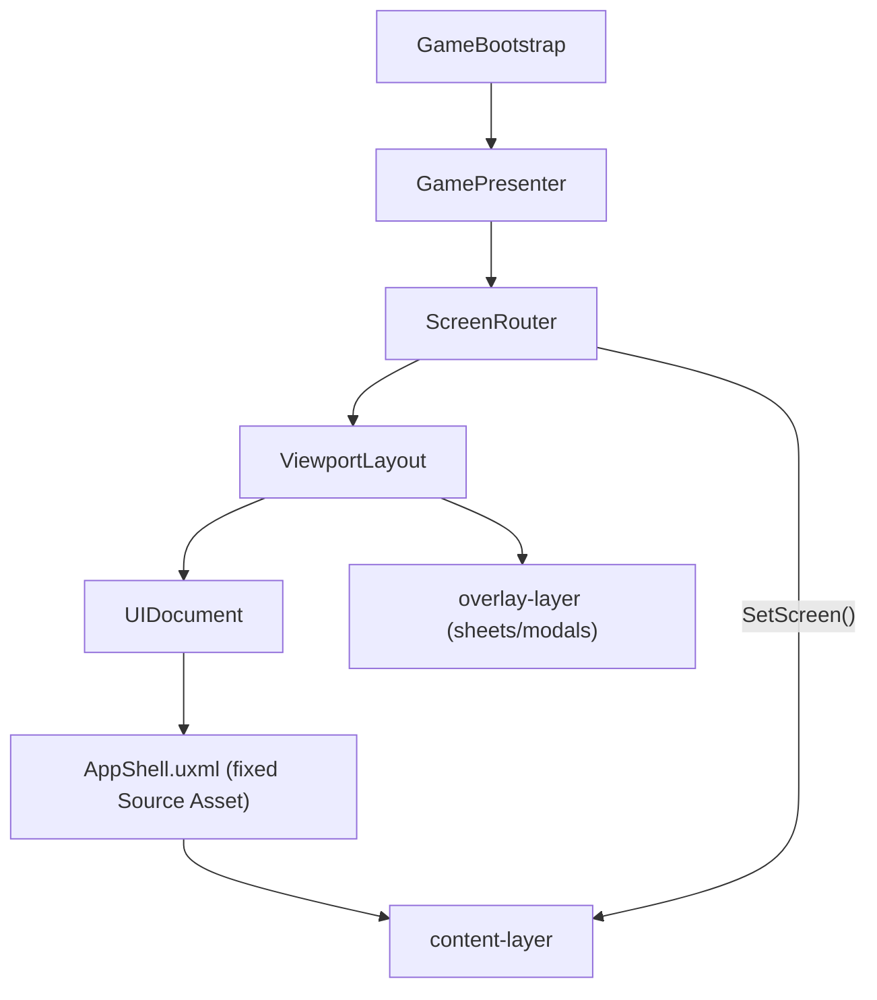

# Kismeta UI (Assets/_Project/UI)

Unity UI Toolkit assets ported from `Docs/wireframes/`. This folder is the **production** UI; wireframe docs under `Docs/wireframes/` are design references and may lag the shipped layout.

## File layout

| Path | Contents |
|------|----------|
| `USS/` | Shared `Kismeta.uss` (canonical) + per-screen stylesheets |
| `UXML/batch1/` | Title, SetupSheet, Join, Resume, Codex |
| `UXML/batchN/` | Screen layouts (batches 2–7) |
| `UXML/shell/` | `AppShell.uxml`, `GameplayHud`, `WaitingHud` |
| `Scripts/Framework/` | ViewportLayout, ScreenRouter, GamePresenter, CommandBridge |
| `Scripts/Controllers/` | Title, Join, Resume, Codex, GameplayHud, WaitingHud |
| `Scripts/Components/` | CardChipFactory, RivalStripBuilder |
| `Scripts/Setup/` | `UiSetupConfig`, mapper to Core `GameMode` |
| `Settings/` | `KismetaPanelSettings.asset` (380×844 **reference** only) |
| `Editor/` | Menu items under **Kismeta → UI** |

## Architecture (single-host model)

Production UI uses **one `UIDocument` on `GameBootstrap`**, not one per screen. The wireframe prototype pattern (each screen with its own UIDocument + Source Asset) is obsolete.



| Piece | Role |
|-------|------|
| **`AppShell.uxml`** | The **only** UIDocument Source Asset. Provides `content-layer` + `overlay-layer`. Never assign TitleScreen or ad-hoc layouts here. |
| **`ScreenRouter`** | Maps screen ids to UXML; calls `ViewportLayout.SetScreen()` to swap children in `content-layer`. |
| **`ViewportLayout`** | Safe-area padding, viewport classes, modal/sheet overlays, full-bleed stretch for instantiated screens. |
| **`GamePresenter`** | Routes by `GameLoop` hint / pending human; wires title menu at startup via `InitializeForTitle()`. |
| **`ScreenController`** | Attach/detach/refresh on the host GameObject when the router loads a screen. |
| **`CommandBridge`** | Submits `IGameCommand` to `HotSeatController` (e.g. Pass). |
| **`GameBootstrap`** | `Awake`: sets AppShell on UIDocument; `Start`: Title → Setup sheet → Begin starts the loop. |

Controllers (`TitleScreenController`, etc.) live on the **same GameObject** as `ScreenRouter`. Call `ScreenRouter.RefreshControllers()` after adding components at runtime.

## Phase 2 complete — Batch 1 shell

- **Title** → New game (setup sheet), **Resume**, **Join**, **How to play** (Codex → Terms), **Codex**
- **Join** — room-code entry; back returns to title (multiplayer stub)
- **Resume** — empty-state list; persistence stub
- **Codex** — tabbed reference + search filter (static glossary samples)
- **Setup sheet** — unchanged compact overlay; Begin starts the game loop

## Phase 1 — UI spine (foundation)

- Title → Setup sheet → gameplay placeholder HUD (`GameplayHud` / `WaitingHud`)
- Setup sheet uses `SetupSheetState`; maps wireframe "Magnus" to `GameMode.MagnusAlchemist`
- IMGUI `GameDebugUI` remains available via **Debug Ui Fallback** on `GameBootstrap`

## Bootstrap setup

Open `Bootstrap.unity` (or your play scene with `GameBootstrap`), then:

| Menu item | Purpose |
|-----------|---------|
| **Kismeta → UI → Configure Panel Settings (Responsive)** | Scale With Screen Size (380×844 ref), match 0.5, opaque `--panel-dark` clear color |
| **Kismeta → UI → Wire Bootstrap UI References** | Assigns AppShell, screens, PanelSettings on `GameBootstrap` |
| **Kismeta → UI → Setup Bootstrap Scene** | Adds full UI stack to `GameBootstrap`, clears legacy Initial Screen |

**Inspector checklist after setup:**

- UIDocument **Source Asset = AppShell** (not TitleScreen, not "Root Layout")
- ViewportLayout **Initial Screen = None**
- GameBootstrap **Use Production Ui** = on
- **Save the scene** (`Ctrl+S`)

**Play-test:** Title → Join / Resume / Codex / How to play (back to title) → New game → Begin → gameplay HUD; Pass during free-action phases.

## Full-bleed / responsive rules

380×844 is the **design baseline** for proportions and PanelSettings reference resolution — not a layout width cap.

**Flex chain** (every new screen must participate):

```
panel root → .kismeta-root → .app-shell → .content-layer → .screen-host → .screen
```

- **`Instantiate()` shrink-wraps** UXML in a wrapper. `ViewportLayout.SetScreen()` adds `.screen-host` and inline stretch styles. Do not rely on `height: 100%` alone on `.screen`.
- **Panel root** is stretched in `EnsurePanelRootFillsViewport()`.
- **USS canonical copy:** `Assets/_Project/UI/USS/Kismeta.uss` (sync `Docs/wireframes/Kismeta.uss` when changing shared tokens).
- **No runtime USS custom-property writes** — Unity does not support writing USS variables from C#. PanelSettings scales typography; `ViewportLayout` applies safe-area padding and `.viewport--*` classes only.

| Token / class | Purpose |
|---------------|---------|
| PanelSettings | Scale With Screen Size (380×844 reference), opaque clear color |
| `ViewportLayout` | Safe area, overlays, screen stretch |
| `.screen-host` | UXML instantiate wrapper — must fill content layer |
| `.viewport--tablet` | Shortest side ≥ 600dp |

**Test in Game view:** 390×844, 428×926, 768×1024 portrait.

## Troubleshooting

| Symptom | Cause | Fix |
|---------|-------|-----|
| UI flashes then blue screen | TitleScreen or custom layout as UIDocument Source Asset; tree reload wipes `content-layer` | Source Asset = AppShell only; run **Setup Bootstrap Scene** |
| UI centered with blue bars top/bottom | `TemplateContainer` from `Instantiate()` not stretching | `.screen-host` + `StretchToContentLayer()` in ViewportLayout (automatic if using router) |
| Title buttons do nothing | Title menu not wired before session exists | `GamePresenter.InitializeForTitle()` at startup |
| Missing script on controllers | Components added while scripts had compile errors | Remove broken components; re-run **Setup Bootstrap Scene** |
| `GameMode.Magnus` compile error | Wireframe shorthand vs Core enum | Use `GameMode.MagnusAlchemist` — see `UiSetupConfigMapper` |
| Font `MissingAssetReference` warnings | Serif/icon fonts not imported | See `Fonts/README.md` — non-blocking, falls back to default UI font |

## Design reference

Visual tokens, components, and per-screen specs: [`Docs/wireframes/UI_styleGuide.md`](../../Docs/wireframes/UI_styleGuide.md).

## Next: Phase 3 — Main scene controllers

Port Autumn/Summer/Spring-hub/Winter-hub with real `Bind()` and replace the gameplay placeholder HUD.
