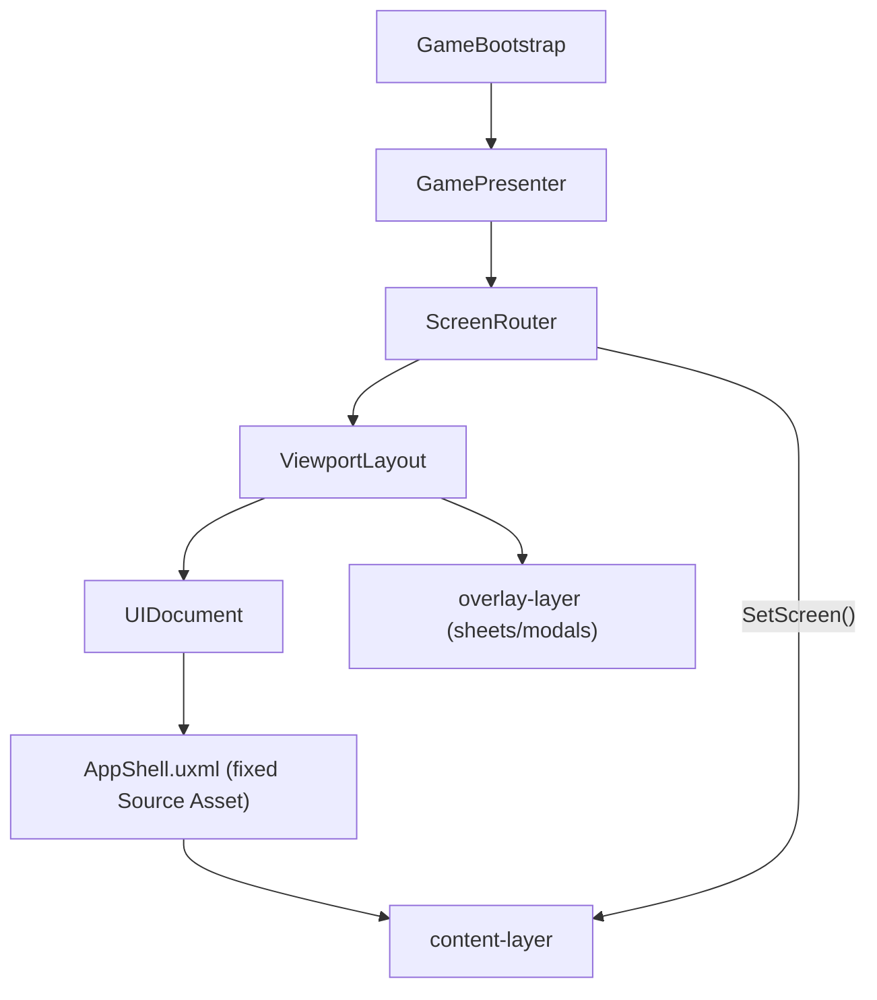

# Kismeta UI (Assets/_Project/UI)

Unity UI Toolkit assets ported from `Docs/wireframes/`. This folder is the **production** UI; wireframe docs under `Docs/wireframes/` are design references and may lag the shipped layout.

## File layout

| Path | Contents |
|------|----------|
| `USS/` | Shared `Kismeta.uss` (canonical) + per-screen stylesheets |
| `UXML/batch1/` | Title, SetupSheet, Join, Resume, Codex, AgekeeperContest |
| `UXML/main/` | Season main scenes: SpringHub, SummerMain, AutumnMain, WinterHub |
| `UXML/batch2/` | Ceremony screens: RoundOpen, AgeOpening, season intros, AgeClosing |
| `UXML/batch3/` | Spring/Winter step screens: Commune, WinterUnlock, FatefulWager, CardLimits |
| `UXML/shell/` | `AppShell.uxml`, `WaitingHud` |
| `Scripts/Framework/` | ViewportLayout, ScreenRouter, GamePresenter, CommandBridge |
| `Scripts/Controllers/` | Shell + season main scene controllers |
| `Scripts/Components/` | CardChipFactory, DieAnimator, UiMotion, FateDecisionBindings, RivalStripBuilder |
| `Scripts/Setup/` | `UiSetupConfig`, mapper to Core `GameMode` |
| `Settings/` | `KismetaPanelSettings.asset` (380×844 **reference** only) |
| `Editor/` | Menu items under **Kismeta → UI** |

## Architecture (single-host model)

Production UI uses **one `UIDocument` on `GameBootstrap`**, not one per screen. The wireframe prototype pattern (each screen with its own UIDocument + Source Asset) is obsolete.



| Piece | Role |
|-------|------|
| **`AppShell.uxml`** | The **only** UIDocument Source Asset. Provides `content-layer` + `overlay-layer`. Never assign TitleScreen or ad-hoc layouts here. |
| **`ScreenRouter`** | Maps screen ids to UXML; calls `ViewportLayout.SetScreen()` to swap children in `content-layer`. |
| **`ViewportLayout`** | Safe-area padding, viewport classes, modal/sheet overlays, full-bleed stretch for instantiated screens. |
| **`GamePresenter`** | Ceremony-first routing via `CeremonyGate`; hint-based step screens (`Commune`, `CardLimits`); season hubs when human pending; `WaitingHud` for AI turns. |
| **`ScreenController`** | Attach/detach/refresh on the host GameObject when the router loads a screen. |
| **`CommandBridge`** | Submits `IGameCommand` to `HotSeatController` (e.g. Pass). |
| **`GameBootstrap`** | `Awake`: sets AppShell on UIDocument; `Start`: Title → Setup sheet → Begin starts the loop. |

Controllers (`TitleScreenController`, etc.) live on the **same GameObject** as `ScreenRouter`. Call `ScreenRouter.RefreshControllers()` after adding components at runtime.

## Phase 6 complete — Batch 4 Summer actions

- **Overlay architecture:** Summer sub-flows use `ViewportLayout` overlays (`SummerOverlayHost`) while `SummerMain` stays the active `ScreenRouter` screen.
- **Hub:** Craft / Consort sheets, direct Activate, Pass → End Summer confirm modal.
- **Commands:** `CraftReagentCommand`, `ActivateCrucibleCommand`, `BuildAstralHouseCommand`, `PlaceCardWardCommand`, `PassCrucibleActionCommand` (Summer pass fix in `CommandBridge`).
- **Consort sheet** links to Trade / Duel / Gambit via `ContestOverlayHost` (Batch 5).

| Screen | Controller | Command |
|--------|------------|---------|
| Craft & build / Consort sheets | `SummerSheetsController` | navigation |
| Craft reagent | `CraftReagentController` | `CraftReagentCommand` |
| Activate crucible | `ActivateCardController` | `ActivateCrucibleCommand` |
| Build astral house | `BuildHouseController` | `BuildAstralHouseCommand` |
| Place wards | `PlaceWardsController` | `PlaceCardWardCommand` |
| End Summer | `EndSummerController` | `PassCrucibleActionCommand` |

**Summer play-test path:**

Reach Summer → **Craft** sheet → craft reagent → **Activate** crucible → **Craft** → build house → place ward → **Pass** → End Summer confirm → Autumn intro.

## Phase 5 complete — Batch 3 Spring & Winter steps

- **Hint routing:** `ActionHint.Commune` → **Commune**; `ActionHint.DiscardToLimit` → **CardLimits**; `ActionHint.WinterAction` → **WinterHub** (sub-screens opened from hub CTAs).
- **Spring:** **SpringHub** shows zodiac sign + harvest tally after auto roll/harvest; **Commune** tap-swap → `CommuneCommand` → auto Card Lock.
- **Winter:** **WinterHub** → **WinterUnlock** (per-tap `WinterMoveCardCommand`) / **FatefulWager** (`PlaceFatefulWagerCommand` or Pass skip) → **CardLimits** (`DiscardToLimitCommand`) → **AgeClosing**.
- **Deferred:** Full `SpringRollHarvest` screen (display-only on SpringHub); `TransitAge.uxml` (transit via AgeClosing ceremony).

**Full-round play-test path:**

Title → setup → agekeeper → RoundOpen → AgeOpening → SpringIntro → **SpringHub** (sign + harvest) → **Commune** → Summer → Autumn → WinterIntro → **WinterHub** → unlock / wager / pass → **CardLimits** → **AgeClosing** → next round

## Phase 4 complete — Batch 2 ceremonies

- **CeremonyGate:** `GameLoop` pauses at `RoundOpen`, `AgeOpening`, four season intros, and `AgeClosing`; UI calls `Complete()` / `CompleteWithCommand()` to resume.
- **Flow:** Agekeeper contest → **RoundOpen** (roll) → **AgeOpening** → **SpringIntro** → Spring gameplay → season intros at Summer/Autumn/Winter → **AgeClosing** → next round.
- **AI agekeeper:** Non-human agekeeper auto-applies `RollCosmicAgeCommand`; humans still see **AgeOpening** and intros.
- **TransitAge** moved to **AgeClosing** CTA (`next-age-btn`).

## Phase 3 complete — Season main scenes

- **Routing:** `GamePresenter` maps `Season` → `SpringHub` / `SummerMain` / `AutumnMain` / `WinterHub` on human turns; `WaitingHud` while AI decides.
- **Bind:** Status bar, rivals strip, spread dock, step rails (Spring/Winter), cauldrons (Summer), stone label (Autumn) from `GamePublicView`.
- **Pass:** Summer, Autumn, and Winter main scenes wire **Pass** via `CommandBridge` during free-action phases.
- **Card table** opens from season menu buttons via `EndOverlayHost` (Batch 7).

## Phase 2 complete — Batch 1 shell

- **Title** → New game (setup sheet), **Resume**, **Join**, **How to play** (Codex → Terms), **Codex**
- **Join** — room-code entry; back returns to title (multiplayer stub)
- **Resume** — empty-state list; persistence stub
- **Codex** — tabbed reference + search filter (static glossary samples)
- **Setup sheet** → agekeeper contest → game loop
- **Agekeeper contest** — zodiac die roll; winner passed to session setup

## Phase 1 — UI spine (foundation)

- Title → setup → agekeeper → season main scenes / `WaitingHud`
- Setup sheet uses `SetupSheetState`; maps wireframe "Magnus" to `GameMode.MagnusAlchemist`
- **`GameDebugUI`** (IMGUI) is **editor/dev-build only** — optional via `_debugUiFallback` on `GameBootstrap`

## Bootstrap setup

Open `Bootstrap.unity` (or your play scene with `GameBootstrap`), then:

| Menu item | Purpose |
|-----------|---------|
| **Kismeta → UI → Configure Panel Settings (Responsive)** | Scale With Screen Size (380×844 ref), match 0.5, opaque `--panel-dark` clear color |
| **Kismeta → UI → Wire Bootstrap UI References** | Assigns AppShell, screens, PanelSettings on `GameBootstrap` |
| **Kismeta → UI → Setup Bootstrap Scene** | Adds full UI stack to `GameBootstrap`, clears legacy Initial Screen |

**Inspector checklist after setup:**

- UIDocument **Source Asset = AppShell** (not TitleScreen, not "Root Layout")
- ViewportLayout **Initial Screen = None**
- GameBootstrap **Use Production Ui** = on
- **Save the scene** (`Ctrl+S`)

**Play-test:** Title → New game → Start Game → agekeeper contest → **RoundOpen** (roll die) → AgeOpening → SpringIntro → **SpringHub** → **Commune** → season main scenes; season intros between seasons; Winter unlock/wager/limits → **AgeClosing** at Winter end.

## Full-bleed / responsive rules

380×844 is the **design baseline** for proportions and PanelSettings reference resolution — not a layout width cap.

**Flex chain** (every new screen must participate):

```
panel root → .kismeta-root → .app-shell → .content-layer → .screen-host → .screen
```

- **`Instantiate()` shrink-wraps** UXML in a wrapper. `ViewportLayout.SetScreen()` adds `.screen-host` and inline stretch styles. Do not rely on `height: 100%` alone on `.screen`.
- **Panel root** is stretched in `EnsurePanelRootFillsViewport()`.
- **USS canonical copy:** `Assets/_Project/UI/USS/Kismeta.uss` (sync `Docs/wireframes/Kismeta.uss` when changing shared tokens).
- **No runtime USS custom-property writes** — Unity does not support writing USS variables from C#. PanelSettings scales typography; `ViewportLayout` applies safe-area padding and `.viewport--*` classes only.

| Token / class | Purpose |
|---------------|---------|
| PanelSettings | Scale With Screen Size (380×844 reference), opaque clear color |
| `ViewportLayout` | Safe area, overlays, screen stretch |
| `.screen-host` | UXML instantiate wrapper — must fill content layer |
| `.viewport--tablet` | Shortest side ≥ 600dp |

**Test in Game view:** 390×844, 428×926, 768×1024 portrait.

## Troubleshooting

| Symptom | Cause | Fix |
|---------|-------|-----|
| UI flashes then blue screen | TitleScreen or custom layout as UIDocument Source Asset; tree reload wipes `content-layer` | Source Asset = AppShell only; run **Setup Bootstrap Scene** |
| UI centered with blue bars top/bottom | `TemplateContainer` from `Instantiate()` not stretching | `.screen-host` + `StretchToContentLayer()` in ViewportLayout (automatic if using router) |
| Title buttons do nothing | Title menu not wired before session exists | `GamePresenter.InitializeForTitle()` at startup |
| Missing script on controllers | Components added while scripts had compile errors | Remove broken components; re-run **Setup Bootstrap Scene** |
| `GameMode.Magnus` compile error | Wireframe shorthand vs Core enum | Use `GameMode.MagnusAlchemist` — see `UiSetupConfigMapper` |
| Font `MissingAssetReference` warnings | Serif/icon fonts not imported | See `Fonts/README.md` — non-blocking, falls back to default UI font |

## Design reference

Visual tokens, components, and per-screen specs: [`Docs/wireframes/UI_styleGuide.md`](../../Docs/wireframes/UI_styleGuide.md).

## Phase 7 — Batch 5: Contests (shared)

Trade, Duel, Gambit (Summer Consort), and Opposition (Autumn Oppose) are full-screen modals managed by `ContestOverlayHost` alongside `SummerOverlayHost` on `GameBootstrap`.

```
Summer Consort sheet ──► ContestOverlayHost (Trade / Duel / Gambit)
Autumn Oppose button ──► ContestOverlayHost (Opposition)
                              │
                              ▼
                        CommandBridge.TrySubmit ──► HotSeatController
```

| Screen | Command | Notes |
|--------|---------|-------|
| Trade | `DirectTradeCommand` | Immediate 1:1 spread swap; dual trays |
| Duel | `InitiateDuelCommand` | Rival pick → ante → d12 roll from `DuelResolvedEvent` |
| Gambit | `InitiateGambitCommand` | Rival pick → ward fee preview (skip if 0) → stake → roll |
| Opposition | `InitiateOppositionCommand` | Forging targets only → ward fee → tally → Stasis result on win |

### Play-test checklist

**Summer:** Consort → Duel (ante + roll) → Consort → Trade (1-for-1 swap) → Consort → Gambit (warded rival).

**Autumn:** Oppose → fee → tally → Stasis result panel on win.

Overlays dismiss automatically when it is no longer the human player's turn (`DismissIfNotHumanTurn`).

## Phase 8 — Batch 6: Autumn forge actions

Fire, Temper, Manage Cards, Leave Stasis, and End Autumn confirm are full-screen modals managed by `AutumnOverlayHost` on `GameBootstrap`. Opposition remains on `ContestOverlayHost` (Batch 5).

```
AutumnMain action bar ──► AutumnOverlayHost (Fire / Temper / Cards / Leave Stasis / End Autumn)
Autumn Oppose button  ──► ContestOverlayHost (Opposition)
                              │
                              ▼
                        CommandBridge.TrySubmit ──► HotSeatController
```

| Screen | Command | Notes |
|--------|---------|-------|
| Fire | `FireStoneCommand` | Mantle + Active slot; spread alignment via `AlchemicalValidator`; fixed `AlchemicalCost` |
| Temper | `TemperCommand` | Eligible Fired slot from prior round; winning CTA when next position is Altar |
| Manage cards | _(read-only)_ | Crucible pills, spread, hand, reagents |
| Leave Stasis | `LeaveStasisCommand` | 2 Salt when forge spot open; clash via `StasisOppositionEvent` |
| End Autumn | `PassCrucibleActionCommand` | Pass opens confirm modal (like Summer End Summer) |

### Autumn play-test path

Reach Autumn → **Fire** (mantle + alignment + cost) → **Temper** (after full forging round) → **Oppose** (Batch 5) → **Cards** review → enter **Stasis** (via opposition loss) → **Leave Stasis** (2 Salt) → **Pass** → End Autumn confirm → Winter intro.

## Phase 9 — Batch 7: End and overlays

Victory, Chronicle, Card Table, and Card Modals complete the 55-screen flow map (#50–55).

```
IsOver / GameEndedEvent ──► Victory (ScreenRouter)
Victory ──► Chronicle (sub-screen)
Season menu-btn ──► EndOverlayHost (CardTable / CardModals)
CardTable rival actions ──► ContestOverlayHost (preselected rival)
Spread chip tap ──► CardModals inspect
AdeptDecision hint ──► CardModals adept (payment picker)
```

| Screen | Host | Notes |
|--------|------|-------|
| Victory (#50) | `ScreenRouter` | Standings by stone position; New Great Year resets session |
| Chronicle (#51) | `ScreenRouter` | `GameChronicle` journal + Painter2D race chart + contest W/L |
| Card table (#52) | `EndOverlayHost` | Public cards only; Summer duel/gambit/trade launchers |
| Inspect (#53) | `EndOverlayHost` | Tap any spread chip; alignment vs cosmic age |
| Adept (#54) | `EndOverlayHost` | 3-card payment + optional Arcanum swap |
| Fate (#55) | `EndOverlayHost` | Auto-resolve informational modal; async Moon/Fool/Lovers use decision modals (Phase 10) |

### Play-test checklist

**Game end:** Temper winning move at Gold → **Victory** → **View Chronicle** (chart + contest record) → **New Great Year** (setup sheet).

**Card table:** Summer menu → survey rivals → tap spread chip (inspect) → **duel** rival (skips target step).

**Adept:** Draw Adept in Spring harvest → adept modal opens → select 3 payment cards → Place or Hold.

### Caveats

- Tarot art sprites and Victory halo remain USS/icon placeholders.

## Phase 10 — Cleanup

Production UI integration is complete. Release builds use UI Toolkit only; no `_debugUiFallback` required.

```
PendingHint Fate* ──► EndOverlayHost (Moon / Reagent / Lovers modals)
CommandBridge.TrySubmit ──► HotSeatController (unblocks GameLoop)
```

| Area | Notes |
|------|-------|
| Async Fate | Moon keep-2, Fool reagent, Lovers target/reward modals in `CardModals.uxml` |
| Debug | `GameDebugUI` compiled only in Editor / Development builds |
| Motion | `DieAnimator` (12×70ms); agekeeper, RoundOpen, contests; sheet rise; Spring wheel settle; Commune chip pulse |
| Accessibility | `.sr-only` summaries on major screens; alignment corner dots on chips; chart point shapes |
| Dead code | `PlayerDirector` removed; `GameplayHud` unregistered from router |

### Play-test gate (no debug fallback)

1. Full Great Year — Title → setup → play through Victory → New Great Year
2. Human draws **Moon**, **Fool**, and **Lovers** in a 3+ player Spring (decision modals appear)
3. Agekeeper contest + RoundOpen dice tumble before continue/submit
4. Card table from Summer menu → inspect → duel rival
5. `_debugUiFallback` **off** throughout
