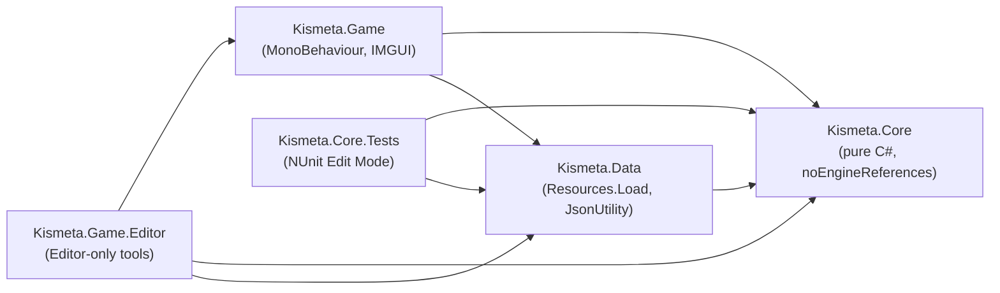

# Kismeta AGY — Architecture Reference

> **Audience:** A Unity/C# developer building or extending the production GUI game on top of the bootstrap engine. This document covers code architecture, not game rules. For game rules see [`Docs/Rules/`](Rules/overview.md).

---

## Table of Contents

1. [Purpose & Scope](#1-purpose--scope)
2. [Repository Layout](#2-repository-layout)
3. [Assembly Dependency Graph](#3-assembly-dependency-graph)
4. [Core Layer — The Game Engine](#4-core-layer--the-game-engine)
   - 4a. [Command / Event Pattern](#4a-command--event-pattern)
   - 4b. [GameSession — Root Aggregate](#4b-gamesession--root-aggregate)
   - 4c. [Domain Types](#4c-domain-types)
   - 4d. [Mutable Entities](#4d-mutable-entities)
   - 4e. [Phase Machine](#4e-phase-machine)
   - 4f. [Visibility Model](#4f-visibility-model)
5. [Rule Services Layer](#5-rule-services-layer)
   - 5a. [GameRuleSet — Service Bundle](#5a-gameruleset--service-bundle)
   - 5b. [Per-Season Services](#5b-per-season-services)
   - 5c. [Cross-Cutting Services](#5c-cross-cutting-services)
6. [Player Controller Pattern](#6-player-controller-pattern)
   - 6a. [IPlayerController](#6a-iplayercontroller)
   - 6b. [GameLoop Orchestration](#6b-gameloop-orchestration)
   - 6c. [ActionHint Enum](#6c-actionhint-enum)
   - 6d. [GameContext — All Properties](#6d-gamecontext--all-properties)
7. [Data Pipeline](#7-data-pipeline)
8. [Bootstrap Wiring](#8-bootstrap-wiring)
9. [Full Request / Command Flow](#9-full-request--command-flow)
10. [Implementation Status](#10-implementation-status)
11. [GUI Integration Guide](#11-gui-integration-guide)
12. [Test Coverage Map](#12-test-coverage-map)

---

## 1. Purpose & Scope

This document describes the technical architecture of the Kismeta AGY game engine — a layered C# system that runs the full game rules independently of Unity's rendering or input pipeline. The engine is intentionally decoupled: Unity MonoBehaviours sit in a thin outer shell (`Kismeta.Game`) that bootstraps the engine and passes player input through a controller interface. Everything beneath that shell (`Kismeta.Core`) is pure C# with no Unity references, fully unit-testable outside of Play Mode.

The current state is a **bootstrap / hot-seat prototype**: two to four players (any mix of human and simple AI) play a full Quickplay-mode game via an IMGUI debug panel. The bootstrap is the foundation on which the production Unity GUI will be built. This document explains every architectural boundary, pattern, and integration point a developer needs to know to build that full game.

---

## 2. Repository Layout

Only the authored folders are listed. `Library/`, `Temp/`, and `Logs/` are generated by Unity and are excluded from source control via `.gitignore`.

```
d:\Unity\KismetaAGY\
├── Assets/
│   └── _Project/
│       ├── Scripts/
│       │   ├── Core/               Kismeta.Core — pure C# game engine (no Unity refs)
│       │   │   ├── Commands/       IGameCommand, IGameEvent, all command & event types
│       │   │   ├── Domain/         Enums and value types (ZodiacSign, Suit, Season, …)
│       │   │   ├── Entities/       Mutable state (GameSession, PlayerState, BoardState, …)
│       │   │   ├── Phases/         PhaseController, PhaseDefinitions, PhaseStepDefinition
│       │   │   ├── Players/        GameLoop, IPlayerController, controllers, GameContext
│       │   │   ├── Rules/          All rule service interfaces and implementations
│       │   │   └── Views/          GamePublicView, PublicPlayerView, PlayerPrivateView
│       │   ├── Data/               Kismeta.Data — JSON loaders (uses Resources.Load)
│       │   │   ├── Loaders/        CardDatabase, CrucibleCodexDatabase, DTOs
│       │   │   └── Generated/      Test-side JSON mirrors (synced by npm run data:sync)
│       │   └── Game/               Kismeta.Game — Unity entry point and debug UI
│       │       ├── Bootstrap/      GameBootstrap, GameDebugUI, PlayerDirector
│       │       └── Editor/         KismetaMenuItems (Editor-only tools)
│       ├── Data/
│       │   └── Resources/          Runtime data loaded by Resources.Load
│       │       ├── cards.json          156 card definitions
│       │       ├── crucible-codex.json 16 codex formula entries
│       │       ├── correspondence.json (no runtime loader — see §7)
│       │       ├── cosmic-ages.json    (no runtime loader — see §7)
│       │       └── game-modes.json     (no runtime loader — see §7)
│       └── Tests/
│           └── EditMode/           Kismeta.Core.Tests — NUnit Edit Mode tests
└── Docs/                           Game rules, card references, this file
    ├── ARCHITECTURE.md             ← you are here
    ├── Rules/
    ├── Cards/
    └── Reference/
```

---

## 3. Assembly Dependency Graph



`Kismeta.Core` is declared with `noEngineReferences: true` in its `.asmdef`. **Nothing in `Core/` may ever `using UnityEngine`**. This constraint is what makes the entire game engine unit-testable outside of Play Mode and portable to a future server backend.

---

## 4. Core Layer — The Game Engine

### 4a. Command / Event Pattern

All game state mutation is driven by a two-step pattern:

1. **Command** — a plain data object implementing `IGameCommand`. The caller constructs a command describing an intent (e.g., `CraftReagentCommand`, `FireStoneCommand`) and passes it to `GameSession.Apply()`.
2. **Event** — a plain data object implementing `IGameEvent`. Rule services call `session.EmitEvent()` when they change state; listeners (UI, AI, logger) react without coupling to the rule logic.

`CommandResult` is returned synchronously from `Apply()`:

| Status | Meaning |
|---|---|
| `Ok` | Command executed successfully |
| `Invalid` | Input was illegal (e.g., wrong cards, wrong phase) |
| `Rejected` | Technically valid but refused by a rule (e.g., insufficient reagents) |
| `NotImplemented` | Command requires a rule service that was not injected |

Commands are intentionally serialisation-friendly (plain fields, no callbacks) to support future networking and replay logging.

**Command inventory by source file:**

| File | Commands |
|---|---|
| `SetupCommands.cs` | `SetupGameCommand` |
| `GameplayCommands.cs` | `HarvestCommand`, `CommuneCommand`, `CraftReagentCommand`, `TemperCommand`, `PassActionCommand`, `PassCrucibleActionCommand`, `RollCosmicAgeCommand`, `RollZodiacCommand`, `SetCardLockCommand`, `PlaceFatefulWagerCommand` |
| `CardCommands.cs` | `RegisterCardCommand`, `WinterMoveCardCommand`, `DiscardToLimitCommand` |
| `CombatCommands.cs` | `InitiateOppositionCommand`, `InitiateDuelCommand`, `InitiateGambitCommand`, `PlaceCardWardCommand`, `PlaceStoneWardCommand`, `FreeArrestedCommand` |
| `FateCommands.cs` | `FateMoonDecisionCommand`, `FateReagentChoiceCommand`, `FateLoversChoiceCommand`, `FateLoversTargetCommand` |
| `AdeptCommands.cs` | `BuyAdeptCommand`, `DeclineAdeptCommand`, `RefreshAdeptCommand` |
| `AstralHouseCommands.cs` | `BuildAstralHouseCommand` |
| `DiceCommands.cs` | `ActivateCrucibleCommand`, `FireStoneCommand`, `LeaveStasisCommand` |
| `PhaseCommands.cs` | `AdvancePhaseCommand`, `TransitAgeCommand` |

### 4b. GameSession — Root Aggregate

`GameSession` is the single source of truth for all mutable game state. Rule services receive it by reference; they never own state themselves.

```csharp
// Core public API (Kismeta.Core.Entities.GameSession)
public CommandResult Apply(IGameCommand command)
public void EmitEvent(IGameEvent evt)
public CardInstance? GetCard(string instanceId)
public ReadOnlyCollection<PlayerState> Players { get; }
public BoardState Board { get; }
public GameRuleSet? Rules { get; }
public PhaseController Phase { get; }
public bool IsOver { get; }
public int WinnerPlayerId { get; }
public GameMode Mode { get; }
public Action<IGameEvent>? OnEvent { get; set; }
```

`Apply()` flow:
1. Calls `Rules.Validator.Validate(session, command)` — season gating and agekeeper checks.
2. Dispatches to the appropriate rule service method via a large `switch` on command type.
3. The rule service mutates state and calls `session.EmitEvent(...)` for each state change.
4. Returns the `CommandResult` from the rule service.

Constructor: `GameSession(string sessionId, GameMode mode, IReadOnlyList<PlayerState> players, GameRuleSet? rules = null)` — requires 2–4 players.

### 4c. Domain Types

All types in `Core/Domain/` are immutable enums or static helpers. They carry no logic beyond mapping.

**Enums:**

| Type | Values |
|---|---|
| `Season` | `Spring`, `Summer`, `Autumn`, `Winter` |
| `ZodiacSign` | `None`, `Aries` … `Pisces` (13 values) |
| `Suit` | `None`, `Wands`, `Cups`, `Pentacles`, `Swords` |
| `Planet` | `None`, `Sun`, `Moon`, `Mercury`, `Venus`, `Mars`, `Jupiter`, `Saturn` |
| `Element` | `None`, `Fire`, `Water`, `Earth`, `Air` |
| `ReagentType` | `Sulphur`, `AquaRegia`, `Vitriol`, `Quicksilver`, `Salt` |
| `Rank` | `None`, `Ace` (1) … `Ten` (10), `Princess` (11), `Knight` (12), `Queen` (13), `King` (14) |
| `StoneState` | `Tempering`, `Forging`, `Stasis`, `Complete` |
| `CrucibleCardState` | `Dormant`, `Active`, `Fired`, `Arrested`, `Discarded` |
| `CardZone` | `Deck`, `Discard`, `Spread`, `Hand`, `Arcanum` |
| `GameMode` | `Quickplay`, `Standard`, `MagnusAlchemist` |
| `MajorArcanaType` | `None`, `Fate`, `Adept` |
| `Deck` | `Kismeta`, `Crucible` |
| `CrucibleGroup` | `None`, `A`, `B`, `C`, `D` |
| `CodexVariant` | `None`, `A`, `B`, `C`, `D` |
| `CodexFormulaType` | `None`, `AnyThreePlanet`, `RankSum` |
| `CardVariant` | `NotApplicable`, `One`, `Two` |
| `PlayerColor` | `Red`, `Green`, `Blue`, `White` |

**Static mapping helper (`Correspondence`):**

```csharp
Correspondence.ElementFor(Suit suit)          // Suit → Element
Correspondence.ReagentFor(Suit suit)          // Suit → ReagentType
Correspondence.SuitFor(ReagentType reagent)   // ReagentType → Suit
Correspondence.ElementFor(ZodiacSign sign)    // ZodiacSign → Element
Correspondence.PlanetFor(ZodiacSign sign)     // ZodiacSign → Planet
```

**Value types in `Core/Entities/` (not enums, but small structs):**

| Type | Key members |
|---|---|
| `StonePosition` | `Value` (0–8), `IsMantle`, `IsForge`, `IsAltar`, `Advance()`, static `Start`/`Altar` |
| `CosmicEffectFlags` | `HarvestBaseBonus`, `WildCourtSuit`, `SaltCostsTwo`, `CheapCraftSuit`, `CheapCraftReagent`, static `Default` |
| `ReagentCost` | `Sulphur`, `AquaRegia`, `Vitriol`, `Quicksilver`, `Salt`, `Total`, static `Zero` |

### 4d. Mutable Entities

These classes hold all runtime game state. Only `GameSession.Apply()` should mutate them; rule services do so under the session's authority.

**`PlayerState`** — everything owned by one player:

| Property | Type | Notes |
|---|---|---|
| `PlayerId` | `int` | Immutable slot index |
| `Color` | `PlayerColor` | Immutable |
| `IsAgekeeper` | `bool` | Changes on `TransitAgeCommand` |
| `CurrentSign` | `ZodiacSign` | Set each Spring by `RollZodiac` |
| `AssignedCodex` | `CodexVariant` | Set during setup |
| `Spread` | `List<string>` | Instance IDs of cards in Spread zone |
| `Hand` | `List<string>` | Instance IDs of cards in Hand zone |
| `Arcanum` | `List<string>` | Instance IDs of cards in Arcanum zone |
| `StonePosition` | `StonePosition` | Current stone board position |
| `StoneState` | `StoneState` | Tempering / Forging / Stasis / Complete |
| `StoneWardCount` | `int` | Reagent wards on the stone |
| `ReturnedFromStasisThisRound` | `bool` | Cleared by `Transit` |
| `BesiegedBonusCount` | `int` | +1 per successful Opposition defence; cleared by `Transit` |
| `UnplacedCoals` | `int` | Coals available to assign to crucible slots |
| `FatefulWagerSign` | `ZodiacSign` | The predicted sign for this round's wager |
| `FatefulWagerCards` | `List<string>` | Cards wagered |
| `ArrestedAdepts` | `HashSet<string>` | Adept card IDs arrested by Tower Fate |
| `AstralHouses` | `HashSet<ZodiacSign>` | Signs for which houses are built |
| `UnplacedAstralHouses` | `int` | Houses purchased but not placed |
| `PersonalCosmicEffects` | `CosmicEffectFlags` | Merged effect of own sign + house signs + cosmic age |
| `CrucibleSlots` | `List<PlayerCrucibleSlot>` | Four codex slots |

Reagent helpers: `GetReagent(ReagentType)`, `AddReagent(ReagentType, int)`, `SpendReagent(ReagentType, int)`.

**`BoardState`** — shared table state:

| Property | Type |
|---|---|
| `RoundNumber` | `int` |
| `CosmicAgeSign` | `ZodiacSign` |
| `CommonDeck` | `Stack<string>` |
| `CommonDiscard` | `List<string>` |
| `CrucibleDeck` | `Stack<string>` |
| `CrucibleDiscard` | `List<string>` |
| `CosmicEffect` | `CosmicEffectFlags` (board-wide) |
| `PendingAdeptDecisions` | `List<(int PlayerId, string AdeptCardId)>` |
| `PendingFateDecisions` | `List<(int PlayerId, string FateCardId, int ArcanaNumber)>` |
| `FateMoonDrawnCardIds` | `List<string>` |
| `BestOfThreeDuels` | `bool` |

**`CardInstance`** — a single physical card in play:

```csharp
string InstanceId     // unique runtime ID (e.g. "wands-ace-1")
string DefinitionId   // links to CardDefinition in ICardDatabase
CardZone Zone         // current zone
int OwnerId           // current owner (-1 = unowned / in shared deck)
bool IsFaceDown
bool IsFired
bool IsArrested
void MoveTo(CardZone zone, int newOwnerId = -1)
```

**`PlayerCrucibleSlot`** — one of a player's four codex slots:

```csharp
CrucibleCardState State    // Dormant → Active → Fired / Arrested
bool HasCoal
int WardCount
string? AlchemicalFormula  // set when activated; null while Dormant
string? CardInstanceId     // the activated card's instance ID
```

### 4e. Phase Machine

`PhaseController` is a lightweight tracker — it records where the game is in the seasonal cycle but does not execute logic.

```csharp
Season CurrentSeason { get; }
int CurrentStepIndex { get; }
IReadOnlyList<PhaseStepDefinition> CurrentSteps { get; }
PhaseStepDefinition CurrentStep { get; }
bool IsFirstStepOfSeason { get; }
bool IsLastStepOfSeason { get; }
void SetSeason(Season season)     // jump to the start of a season (step 0)
Season Advance()                  // move to next step; wraps to next season
static Season NextSeason(Season)
```

`PhaseDefinitions.StepsFor(Season)` returns the canonical step list for each season:

| Season | Steps | Style |
|---|---|---|
| Spring | 5 | Ordered (scripted) |
| Summer | 6 | Pool (players act freely until all pass) |
| Autumn | 5 | Ordered |
| Winter | 4 | Pool |

`GameLoop` always uses `SetSeason(season)` to jump between seasons, not `Advance()`. `AdvancePhaseCommand` exists for manual/debugging use. An `PhaseChangedEvent` is emitted on every transition so that the UI always stays in sync.

Season cycle: `Spring → Summer → Autumn → Winter → Spring`. Winter's `Transit()` increments `BoardState.RoundNumber`.

### 4f. Visibility Model

The engine exposes two read-only snapshot types. They are rebuilt fresh from `GameSession` at each decision point — they hold no live references to mutable state.

| Type | Factory | Contains | Hides |
|---|---|---|---|
| `GamePublicView` | `GamePublicView.From(session)` | Phase info; all players' Spread, Arcanum, stone, reagents, crucible slot states, astral houses, codex variant, hand *count*; deck counts; cosmic age | Each player's Hand card IDs; codex activation formulas for Dormant slots |
| `PublicPlayerView` | (inner, part of `GamePublicView`) | Per-player public zones and board pieces | Hand IDs, Dormant slot formulas |
| `PlayerPrivateView` | `PlayerPrivateView.From(session, playerId)` | Full `GamePublicView` + own Hand card IDs + own codex formulas | Opponents' hands and formulas |

**Critical rule for networking:** `PlayerPrivateView` must only ever be delivered to the player it belongs to. Sending it to an opponent is a rules violation. The controller pattern enforces this boundary — `GameLoop` constructs a `PlayerPrivateView` per player and passes it only to their own controller.

---

## 5. Rule Services Layer

### 5a. GameRuleSet — Service Bundle

`GameRuleSet` is a plain container that holds all rule service instances. There is no service locator — services are injected at construction time via `GameBootstrap`.

**Required services** (game will not start without them):

| Property | Type | Role |
|---|---|---|
| `CardDatabase` | `ICardDatabase` | Look up card definitions |
| `CodexDatabase` | `ICrucibleCodexDatabase` | Look up codex formula definitions |
| `Setup` | `GameSetupService` | Shuffle and deal initial state |
| `Harvest` | `IHarvestService` | Spring phase (SpringRules) |
| `Crucible` | `ICrucibleService` | Crucible mechanics (CrucibleRules) |
| `Crafting` | `ICraftingService` | Reagent crafting (CraftingRules) |
| `Winter` | `WinterRules` | Winter phase |
| `Validator` | `IActionValidator` | Pre-command validation (ActionValidator) |

**Optional services** — commands that require these return `NotImplemented` when `null`:

| Property | Type | Role |
|---|---|---|
| `AstralHouse` | `AstralHouseService?` | Astral House building |
| `CosmicEffect` | `CosmicEffectService?` | Cosmic Age effect application |
| `FateResolver` | `FateCardResolver?` | Fate card resolution |
| `AlchemicalValidator` | `AlchemicalAlignmentValidator?` | Alchemical formula validation |
| `Alignment` | `IAlignmentService?` | Alignment point calculation |
| `Combat` | `CombatRules?` | Duel and Gambit |
| `Trade` | `TradeService?` | Direct card trades |

### 5b. Per-Season Services

#### `SpringRules` implements `IHarvestService`

Primary service for Spring. Also handles Adept and Fate routing triggered by the harvest.

| Method | Description |
|---|---|
| `RollCosmicAge(session)` | Rolls cosmic age sign, applies board-wide `CosmicEffectFlags` |
| `RollZodiac(session, playerId)` | Rolls player's sign, recomputes `PersonalCosmicEffects` |
| `CalculateHarvestCount(session, playerId)` | Returns harvest card count (base + cosmic bonuses) |
| `ExecuteHarvest(session, playerId)` | Draws cards, routes Major Arcana, triggers deck catastrophe if empty |
| `HandleCommune(session, playerId, spreadIds, handIds)` | Validates and executes the Commune action |
| `HandleBuyAdept(session, playerId, adeptId, paymentIds, swapOutId?)` | Validates and executes Adept purchase |
| `HandleDeclineAdept(session, playerId, adeptId)` | Declines a pending Adept decision |
| `RouteDrawnCard(session, playerId, cardId, minorPool?)` | Routes a newly drawn card to Arcanum (Major Arcana) or the minor pool |

**Deck catastrophe:** if the common deck is empty after reshuffling the discard, `FatesIntervene()` forces all players to discard their hands to the deck and emits `HarvestCatastropheEvent`.

#### `CrucibleRules` implements `ICrucibleService`

Used during Summer (activation) and Autumn (firing, opposition, wards).

| Method | Description |
|---|---|
| `TryActivate(session, playerId, slotIndex, cardIds)` | Activates a codex slot with submitted cards; validates formula via `AlchemicalAlignmentValidator` |
| `TryFire(session, playerId, slotIndex, alignmentCardIds?)` | Fires a stone from a Forging position; checks all alignment cards are in Spread |
| `TryTemper(session, playerId)` | Advances stone from Tempering to Forging |
| `TryLeaveStasis(session, playerId)` | Returns stone to last Forge position; triggers Stasis Opposition if another player is already Forging there |
| `TryOppose(session, attackerId, defenderId)` | Full Opposition: charges attacker reagents equal to defender's stone wards; rolls dice with besieged bonus and tie-break reroll |
| `TryPlaceCardWard(session, playerId, slotIndex, reagentType)` | Places a reagent ward on a crucible slot |
| `TryPlaceStoneWard(session, playerId, reagentType)` | Places a reagent ward on the stone |
| `TryRefreshAdept(session, playerId, adeptCardId)` | Clears the arrested flag from an adept by spending Salt |

**Besieged Bonus:** `defender.BesiegedBonusCount` is added to the defender's Opposition score. Increments on each successful defence; cleared by `WinterRules.Transit()`.

**Stasis Opposition:** when `TryLeaveStasis` resolves to a position already occupied by a Forging stone, a dice tiebreak determines who stays (loser returns to Stasis). Emits `StasisOppositionEvent`.

#### `CraftingRules` implements `ICraftingService`

Active in Summer, Autumn, and Winter.

| Method | Description |
|---|---|
| `TryCraft(session, playerId, reagentType, cardIds)` | Validates submitted cards pay the reagent's cost; checks both board-wide and personal `CosmicEffectFlags` for `SaltCostsTwo`, `CheapCraftSuit`, `CheapCraftReagent`, and `WildCourtSuit` |

#### `WinterRules`

| Method | Description |
|---|---|
| `TryMoveCard(session, playerId, cardId, toSpread)` | Moves a card between Hand and Spread |
| `TryPlaceWager(session, playerId, predictedSign, cardIds)` | Stakes cards on a predicted cosmic sign for next Spring |
| `ResolveWagers(session, cosmicSign)` | Called after the Spring cosmic roll; winners receive their staked cards back |
| `TryDiscardToLimit(session, playerId, discardSpreadIds, discardHandIds)` | Enforces hand/spread limits (5 / 5) |
| `EnforceLimits(session)` | Checks all players and flags any who need to discard |
| `ClearFateCardsFromArcanum(session)` | Removes resolved Fate cards from Arcanum at round end |
| `Transit(session)` | Clears per-round state (`BesiegedBonusCount`, `ReturnedFromStasisThisRound`), increments round, rotates Agekeeper |

Constants: `SpreadLimit = 5`, `HandLimit = 5`.

### 5c. Cross-Cutting Services

These services are not tied to one season and may be called from multiple rule services.

#### `ActionValidator` implements `IActionValidator`

Called by `GameSession.Apply()` before any rule service. Validates:
- Commands are only accepted in the correct season (e.g., `ActivateCrucibleCommand` requires Summer or Autumn).
- Agekeeper-gated commands (`RollCosmicAgeCommand`, `RollZodiacCommand`) are only submitted by the current Agekeeper.

Returns `CommandResult.Invalid` on violations; commands never reach the rule service.

#### `AlignmentService` implements `IAlignmentService`

```csharp
int CalculateAlignmentPoints(GameSession session, int playerId, ZodiacSign referenceSign)
```

Counts how many cards in the player's Spread match the reference sign's suit, planet, and element correspondences. Used by `CrucibleRules.TryFire()` and `CrucibleRules.TryOppose()`.

#### `CosmicEffectService`

```csharp
void Apply(GameSession session, ZodiacSign sign)          // update BoardState.CosmicEffect
void Reset(GameSession session)                            // clear board effect
static CosmicEffectFlags EffectFor(ZodiacSign sign)        // sign → flags
static CosmicEffectFlags Merge(CosmicEffectFlags a, CosmicEffectFlags b)
static CosmicEffectFlags ComputePersonalEffects(
    ZodiacSign rolledSign,
    IEnumerable<ZodiacSign> houseSigns,
    ZodiacSign cosmicAgeSign)
```

`ComputePersonalEffects` is called whenever a player's sign changes (zodiac roll) or they build a new Astral House, recomputing `PlayerState.PersonalCosmicEffects`.

#### `FateCardResolver`

Handles multi-step Fate card effects. Some Fate cards auto-resolve (the method returns `true`); others require player decisions which are tracked in `BoardState.PendingFateDecisions`.

| Method | Description |
|---|---|
| `Resolve(session, drawerId, fateCardId, arcanaNumber)` | Routes by arcana number to the correct effect; returns `true` if fully resolved |
| `HandleMoonDecision(session, playerId, keepCardIds)` | Player keeps chosen subset of Moon-drawn cards |
| `HandleFoolReagentChoice(session, chooserId, reagentType)` | Player collects a free reagent from the Fool |
| `HandleLoversChoice(session, drawerId, drawCards, chosenReagent)` | Drawer accepts draw/reagent reward |

**Lovers two-step:** drawer first selects a target (`FateLoversTargetCommand`), then chooses the reward (`FateLoversChoiceCommand`). Only the drawer receives the reward.

#### `AstralHouseService`

```csharp
CommandResult TryBuild(GameSession session, int playerId, ZodiacSign sign,
                       IReadOnlyList<string> paymentCardIds)
```

Validates: player has an unplaced house, sign not already built, 1 planet-matching card submitted (Quickplay). After building, calls `CosmicEffectService.ComputePersonalEffects` to update `PersonalCosmicEffects`.

#### `CombatRules`

Duel and Gambit are Summer social interactions distinct from Autumn's Opposition.

| Method | Description |
|---|---|
| `TryDuel(session, attackerId, defenderId, anteCardId)` | Dice roll; winner takes the ante card |
| `TryGambit(session, attackerId, defenderId, offeredCardId)` | Dice roll; winner decides what happens to the offered card |
| `TryFreeArrested(session, playerId, slotIndex)` | Spends Salt to clear an Arrested adept in a crucible slot |

#### `TradeService`

```csharp
CommandResult TryTrade(GameSession session, int initiatorId, int targetId,
                       IReadOnlyList<string> offerCardIds,
                       IReadOnlyList<string> requestCardIds)
```

Validates both sets are minor arcana in the relevant players' Spreads and executes a direct swap. Hot-seat only in the bootstrap.

#### `AlchemicalAlignmentValidator`

Validates the alchemical formula string encoded in each codex slot definition against a player's submitted cards.

```csharp
(bool ok, string reason) Validate(string formula, IReadOnlyList<CardDefinition> cards)
static string Describe(string formula)  // human-readable description for UI
```

Formula segments are parsed into `FormulaSegment` structs with a `SegmentKind` enum: `SuitGroup`, `PlanetGroup`, `StraightSuit`, `SuitPair`, `PlanetPair`, `TwoPairs`.

#### `GameSetupService`

```csharp
CommandResult Setup(GameSession session)
```

Shuffles the common and crucible decks, deals starting hands, assigns codex variants, and sets the initial Agekeeper.

---

## 6. Player Controller Pattern

### 6a. IPlayerController

```csharp
public interface IPlayerController
{
    PlayerSlot Slot { get; }
    bool IsLocalHuman { get; }
    Task<IGameCommand> RequestActionAsync(GameContext context, CancellationToken ct = default);
}
```

`GameLoop` treats all players uniformly through this interface. The concrete implementation determines whether input comes from a human (blocking on UI) or AI (returning immediately).

**Concrete implementations:**

| Class | `IsLocalHuman` | Behaviour |
|---|---|---|
| `HotSeatController` | `true` | Blocks `RequestActionAsync` until `SubmitCommand(IGameCommand)` is called from the UI thread |
| `SimpleAIController` | `false` | Returns a command immediately via `Task.FromResult(DecideX(context))` |

`PlayerSlot` carries `Index`, `Color` (`PlayerColor`), and `ControllerType` (`LocalHuman`, `LocalAI`, or `NetworkRemote`).

### 6b. GameLoop Orchestration

`GameLoop.RunAsync(CancellationToken)` is the game's main loop. It owns the season sequence and delegates to controllers and rule services:

```
SetupGameCommand
└── repeat until session.IsOver:
    ┌── Spring (ordered)
    │   ├── RollCosmicAgeCommand    (agekeeper only)
    │   ├── RollZodiacCommand × N   (each player in order)
    │   ├── HarvestCommand × N      (each player)
    │   ├── Resolve pending Fate/Adept decisions
    │   ├── CommuneCommand × N      (each player)
    │   └── SetCardLockCommand
    ├── Summer (pool: all pass → advance)
    │   └── Players take free actions (activate, craft, house, duel, gambit, trade, …)
    ├── Autumn (pool: all pass → advance)
    │   └── Players take free actions (fire, temper, stasis, oppose, craft, wards, …)
    └── Winter (pool → enforce limits → transit)
        ├── Players move cards hand↔spread, craft, wager
        ├── DiscardToLimitCommand × (any who exceed limits)
        └── TransitAgeCommand
```

**Human input protocol:** before calling `controller.RequestActionAsync()` for a human player, `GameLoop` sets:

```csharp
PendingHumanController = (HotSeatController)controller;
PendingHint = currentHint;
ActivePlayerId = playerId;
```

The UI polls or reads these properties each frame to know who is waiting and what to display.

**Public state exposed by GameLoop:**

```csharp
HotSeatController? PendingHumanController { get; }
ActionHint PendingHint { get; }
int ActivePlayerId { get; }
string? PendingCardId { get; }    // card ID pre-filled for certain Fate decisions
event Action<string>? OnLog;
```

### 6c. ActionHint Enum

`ActionHint` tells the UI and AI what class of decision is currently required:

| Value | Triggered by | Expected command(s) |
|---|---|---|
| `None` | Default / waiting | `PassActionCommand` |
| `Commune` | Spring commune step | `CommuneCommand` |
| `SummerAction` | Summer free-action pool | Any Summer-legal command or `PassActionCommand` |
| `AutumnAction` | Autumn free-action pool | Any Autumn-legal command or `PassActionCommand` |
| `WinterAction` | Winter free-action pool | `WinterMoveCardCommand`, `CraftReagentCommand`, `PlaceFatefulWagerCommand`, `PassActionCommand` |
| `AdeptDecision` | Adept drawn during harvest | `BuyAdeptCommand` or `DeclineAdeptCommand` |
| `FateMoonDecision` | Moon Fate drawn | `FateMoonDecisionCommand` |
| `FateReagentChoice` | Fool Fate drawn | `FateReagentChoiceCommand` |
| `FateLoversTargetPick` | Lovers Fate drawn (step 1) | `FateLoversTargetCommand` |
| `FateLoversChoice` | Lovers Fate drawn (step 2) | `FateLoversChoiceCommand` |
| `DiscardToLimit` | Hand/Spread over limit | `DiscardToLimitCommand` |

### 6d. GameContext — All Properties

`GameContext` is the read-only bundle passed to every `RequestActionAsync` call. Controllers use it to make decisions without touching `GameSession` directly.

| Property | Type | Notes |
|---|---|---|
| `PublicView` | `GamePublicView` | Full public game state snapshot |
| `PrivateView` | `PlayerPrivateView` | Includes own Hand IDs and codex formulas |
| `ActivePlayerId` | `int` | The player being asked for input |
| `Hint` | `ActionHint` | What kind of input is expected |
| `PendingCardId` | `string?` | Pre-filled card ID (e.g. the Fate card being resolved) |
| `MoonDrawnCardIds` | `IReadOnlyList<string>?` | Cards drawn by Moon Fate (for `FateMoonDecision`) |
| `ArcanumAdeptIds` | `IReadOnlyList<string>?` | Available adept IDs (for `AdeptDecision`) |
| `CodexDatabase` | `ICrucibleCodexDatabase?` | For formula lookups during AI decisions |
| `CardDatabase` | `ICardDatabase?` | For card definition lookups |
| `AlchemicalValidator` | `AlchemicalAlignmentValidator?` | For AI to validate formula submissions |

---

## 7. Data Pipeline

Card and codex data originates from a source design file. The `npm run data:sync` command exports it to two runtime JSON files and mirrors for tests.

```
Design source (external tool / spreadsheet)
        │
        ▼  npm run data:sync
┌───────────────────────────────────────────┐
│ Assets/_Project/Data/Resources/           │  ← loaded at Play Mode via Resources.Load
│   cards.json            (156 card defs)   │
│   crucible-codex.json   (16 formulas)     │
└───────────────────────────────────────────┘
┌───────────────────────────────────────────┐
│ Assets/_Project/Scripts/Data/Generated/   │  ← loaded by Edit Mode tests
│   cards.json            (test mirror)     │
│   correspondence.json                     │
│   cosmic-ages.json                        │
│   game-modes.json                         │
└───────────────────────────────────────────┘
        │
        ▼  CardDatabase.LoadFromJson() / CrucibleCodexDatabase.Load()
ICardDatabase              Dictionary<string, CardDefinition>
ICrucibleCodexDatabase     Dictionary<(CodexVariant, int slot), CodexFormulaDefinition>
        │
        ▼  injected into GameRuleSet constructor
All rule services that need card or codex data
```

**Loader classes:**

| Class | JSON key | Output |
|---|---|---|
| `CardDatabase` | `"cards"` | `ICardDatabase` (156 `CardDefinition` records) |
| `CrucibleCodexDatabase` | `"crucible-codex"` | `ICrucibleCodexDatabase` (16 `CodexFormulaDefinition` records) |

Both use `Resources.Load<TextAsset>()` and `JsonUtility`. `CardDatabase.LoadFromJson(string json)` is also used by tests directly (no Play Mode required).

**Files with no runtime loader (deferred):**

| File | Current state |
|---|---|
| `correspondence.json` | Hardcoded in `Correspondence` static class |
| `cosmic-ages.json` | Effects embedded in `CosmicEffectService` |
| `game-modes.json` | `GameMode` enum exists; mode-specific rules not yet branched |

These are candidates for data-driven loading when `Standard` and `MagnusAlchemist` modes are implemented.

---

## 8. Bootstrap Wiring

`GameBootstrap` (a Unity `MonoBehaviour`) is the single runtime wiring point. Nothing else in the project touches Unity's lifecycle methods.

**`Start()` sequence:**

```
1. Load data
   ├── CardDatabase.Load()          → ICardDatabase  (cards.json)
   └── CrucibleCodexDatabase.Load() → ICrucibleCodexDatabase  (crucible-codex.json)

2. Add debug UI
   └── gameObject.AddComponent<GameDebugUI>()

3. BuildSession()
   ├── Construct shared services (cross-injected where needed):
   │     CosmicEffectService, FateCardResolver, AlchemicalAlignmentValidator,
   │     AlignmentService, GameSetupService, SpringRules, CrucibleRules,
   │     CraftingRules, WinterRules, ActionValidator, AstralHouseService,
   │     CombatRules, TradeService
   ├── Assemble GameRuleSet (inject all services)
   ├── Create PlayerState × _totalPlayers (assign PlayerColor)
   ├── Create controllers:
   │     HotSeatController   for slots 0 … (_humanPlayers - 1)
   │     SimpleAIController  for remaining slots
   ├── new GameSession(Guid, _gameMode, players, rules)
   ├── new GameLoop(session, controllers)
   └── Wire session.OnEvent → Debug.Log
       Wire loop.OnLog      → Debug.Log

4. _ui.Bind(session, loop, db, codexDb)

5. StartLoopAsync()
   └── GameLoop.RunAsync(cancellationToken)  [managed Task, cancelled in OnDestroy]
```

**Inspector fields on `GameBootstrap`:**

| Field | Type | Default | Effect |
|---|---|---|---|
| `_humanPlayers` | `int` | 1 | Slots 0…N-1 are `HotSeatController` |
| `_totalPlayers` | `int` | 2 | Total player count (2–4) |
| `_gameMode` | `GameMode` | `Quickplay` | Mode passed to `GameSession` |

**`PlayerDirector`** exists in the same folder as a planned mediator (see §11) but is **not wired** in the current bootstrap. It is safe to ignore for now.

---

## 9. Full Request / Command Flow

The diagram below shows a single human player action from button press to event callback. The AI path skips the `UI → HC → GL` segment entirely.

```mermaid
sequenceDiagram
  participant UI as GameDebugUI
  participant HC as HotSeatController
  participant GL as GameLoop
  participant GS as GameSession
  participant AV as ActionValidator
  participant RS as RuleService

  GL->>GL: Set PendingHumanController, PendingHint, ActivePlayerId
  GL->>HC: await RequestActionAsync(GameContext)
  Note over UI: Next OnGUI() frame
  UI->>UI: Read PendingHumanController + PendingHint
  UI->>UI: Player selects cards, clicks action button
  UI->>HC: SubmitCommand(IGameCommand)
  HC-->>GL: IGameCommand (TaskCompletionSource resolved)
  GL->>GS: Apply(command)
  GS->>AV: Validate(session, command)
  AV-->>GS: CommandResult (Ok or Invalid)
  alt Validation passed
    GS->>RS: TryXxx(session, args...)
    RS->>GS: EmitEvent(IGameEvent)
    GS-->>UI: OnEvent callback (update log)
    RS-->>GS: CommandResult
  end
  GS-->>GL: CommandResult
  GL->>GL: Log result; loop to next action
```

**AI path** (no UI involvement):

```
GL->>AI: await RequestActionAsync(GameContext)
AI-->>GL: Task.FromResult(DecideX(context))  [synchronous]
GL->>GS: Apply(command)
... (same as above from Apply onwards)
```

---

## 10. Implementation Status

### Fully Implemented

**Spring**
- Cosmic age roll and board-wide `CosmicEffectFlags` application
- Per-player zodiac roll with personal `CosmicEffectFlags` recomputation
- Harvest with automatic Fate/Adept routing via `RouteDrawnCard`
- All Fate effects: Moon (draw 3, keep N), Fool (free reagent), Lovers (two-step target + reward), Tower (arrest adepts, free with Salt)
- Adept buy/decline with payment validation
- Commune (redistribute cards between Hand and Spread)
- Card lock enforcement

**Summer / Autumn**
- Crucible slot activation with alchemical formula validation
- Stone firing with alignment card verification
- Stone tempering
- Leave Stasis with Stasis Opposition tiebreak
- Opposition with besieged bonus, reagent-ward cost, and tie-break reroll
- Reagent wards on stones and crucible slots
- Adept refresh (Salt cost)
- Duel and Gambit
- Direct card trade (Spread cards, minor arcana only)
- Crafting with full cosmic effect cost modifiers (board-wide + personal)

**Winter**
- Hand ↔ Spread card movement
- Fateful wager placement and resolution
- Discard-to-limit enforcement
- Round transit (clear per-round state, rotate Agekeeper, increment round)

**Cross-cutting**
- `AlchemicalAlignmentValidator` — full formula parsing and validation
- `ActionValidator` — season gating and agekeeper gating for all commands
- `GamePublicView` / `PlayerPrivateView` visibility model
- `CosmicEffectService` — board-wide and personal effect computation
- `SimpleAIController` — heuristic decisions for all hint types (combat, crafting, housing, communing, trade-pass)

### Simplified for Quickplay Mode

| Rule | Quickplay (current) | Standard (deferred) |
|---|---|---|
| Astral House payment | 1 planet-matching card | 2 cards (one planet-matching) |
| Deck exhaustion | Mass discard + reshuffle (catastrophe) | Full rule differs in detail |
| Best-of-3 Duels | Flag exists (`BestOfThreeDuels`), defaults `false` | Standard mode enables this |

### Bootstrap Stubs / Deferred

| Item | Status |
|---|---|
| `SimpleAIController` | Greedy heuristics only — no lookahead, card value scoring, or opponent modelling |
| `PlayerDirector` | Stub — planned mediator class, not wired in live path |
| `NetworkRemote` controller type | Enum value defined; `IPlayerController` implementation does not exist |
| Production UI | `GameDebugUI` is IMGUI debug-only; no production art, animations, or camera |
| `correspondence.json` loader | No runtime loader; data hardcoded in `Correspondence` static class |
| `cosmic-ages.json` loader | No runtime loader; effects embedded in `CosmicEffectService` |
| `game-modes.json` loader | No runtime loader; mode differences not yet branched in rules |
| `Standard` mode rules | `GameMode.Standard` accepted; rule differences not enforced |
| `MagnusAlchemist` mode | `GameMode.MagnusAlchemist` accepted; rule differences not enforced |

---

## 11. GUI Integration Guide

The bootstrap is designed so that the production UI plugs in cleanly. The core engine does not change; only the outer shell evolves.

### Step 1 — Subscribe to events

```csharp
// In your UI MonoBehaviour's Start() or after Bind():
session.OnEvent += HandleGameEvent;

private void HandleGameEvent(IGameEvent evt)
{
    switch (evt)
    {
        case StoneFiredEvent e:   UpdateStoneVisual(e.PlayerId, e.NewPosition); break;
        case ReagentCraftedEvent e: UpdateReagentCounter(e.PlayerId, e.ReagentType); break;
        case PhaseChangedEvent e:  UpdatePhaseIndicator(e.Season, e.StepIndex); break;
        // ... one case per IGameEvent type
    }
}
```

Every state change emits a typed event. Prefer reacting to events over polling `GamePublicView` every frame.

### Step 2 — Read state via views, never via GameSession directly

```csharp
// Good — uses the visibility model
var view = GamePublicView.From(session);
var privateView = PlayerPrivateView.From(session, localPlayerId);

// Bad — bypasses visibility enforcement, will break networking
var hand = session.Players[0].Hand;
```

Rebuild views when needed (e.g., on each `OnEvent` callback). They are lightweight snapshots.

### Step 3 — Submit commands via HotSeatController

```csharp
// Your UI builds the command from player input, then:
_hotSeatController.SubmitCommand(new CraftReagentCommand(playerId, ReagentType.Salt, cardIds));

// Handle the result if Apply() returned Invalid/Rejected:
// session.OnEvent will NOT fire on failed commands.
// Check loop.PendingHumanController != null to know if the turn is still active.
```

`ActionValidator` rejects illegal commands before they reach rule services — no special UI guard needed, but do display `CommandResult.Message` for user feedback.

### Step 4 — Read PendingHint to drive panel visibility

```csharp
private void Update()
{
    if (_loop.PendingHumanController == null) return;

    _summerPanel.SetActive(_loop.PendingHint == ActionHint.SummerAction);
    _autumnPanel.SetActive(_loop.PendingHint == ActionHint.AutumnAction);
    _fateMoonPanel.SetActive(_loop.PendingHint == ActionHint.FateMoonDecision);
    // … etc.
}
```

### Step 5 — Replace GameDebugUI gradually

`GameBootstrap.Bind()` is the seam. Add your production UI component, call `Bind()` on it the same way `GameDebugUI.Bind()` is called, and remove `GameDebugUI` when ready. No engine changes required.

### Step 6 — Wire PlayerDirector

`PlayerDirector` is intended as the mediator between `IPlayerController` and the Unity scene. In its final form it should:
- Build `GameContext` from `GamePublicView` + `PlayerPrivateView`.
- Drive `RequestActionAsync` → `SubmitCommand` on behalf of human players by bridging Unity UI events.
- Own any per-player camera rigs or UI canvases that track the active player.

Currently it is a stub — the class exists but is unused. Wire it between `GameLoop` and your production input handling.

### Step 7 — Networking

The command/event model is designed for serialisation:

1. Implement `IPlayerController` for `PlayerControllerType.NetworkRemote` — `RequestActionAsync` awaits a message from your network transport.
2. Serialise `IGameCommand` objects (they are plain data) and send them over the wire.
3. On the **host**, call `session.Apply(command)` — the host is the authority.
4. Broadcast `IGameEvent` objects to all clients to update their display state.
5. Send `GamePublicView` to all clients; send `PlayerPrivateView` only to the owning player. **Never** send `PlayerPrivateView` to a non-owner.

---

## 12. Test Coverage Map

All tests are NUnit **Edit Mode** tests in the `Kismeta.Core.Tests` assembly (`Assets/_Project/Tests/EditMode/`). No Play Mode tests exist.

| File | Tests | What is covered |
|---|---|---|
| `CardDatabase_Tests.cs` | 8 | JSON pipeline integrity; 156 total cards; Major/Crucible/Minor counts; per-suit counts; crucible groups; known card lookup; Adept sign assignment |
| `CodexFormulaValidator_Tests.cs` | 13 | `AnyThreePlanet` formula validation; `RankSum` formula validation; Ace rank edge cases |
| `GameSession_Tests.cs` | 9 | Session initialises to Spring; `AdvancePhaseCommand`; event firing; unhandled commands; card lock; card registration; 2–4 player bounds; winner flag; full Spring→Summer transition |
| `PhaseController_Tests.cs` | 8 | Step counts per season; season transitions; Winter→Spring cycle; CardLock step name; full round cycle |
| `PlayerView_Tests.cs` | 5 | Hand IDs hidden in `GamePublicView`; Spread visible in `GamePublicView`; Hand IDs visible in `PlayerPrivateView`; opponent Hand IDs hidden in `PlayerPrivateView`; phase info present |
| `RuleServices_Tests.cs` | ~47 | `GameSetupService`; Spring (cosmic age, zodiac, harvest, commune); Crucible (activate, fire, temper, opposition, stasis, codex formulas); Crafting; Winter (move cards, fateful wager, discard limits, transit) |
| `GameLoop_Tests.cs` | 8 | AI-vs-AI smoke (no crash); setup populates decks; harvest gives ≥3 cards; Agekeeper rotation; setup events; seed variance canary; `ActionValidator` Agekeeper roll rules |

**Total: ~90+ test cases.**

### Known gaps

| Area | Gap |
|---|---|
| `GameBootstrap` | No test for full Unity wiring or Play Mode |
| `GameDebugUI` | No test for human input path or IMGUI rendering |
| `HotSeatController` | `SubmitCommand` / `TaskCompletionSource` flow untested |
| `CrucibleCodexDatabase` | No dedicated test file (used indirectly in rule tests) |
| `AlchemicalAlignmentValidator` | Happy-path covered via `RuleServices_Tests`; edge cases (malformed formula strings, partial matches) not yet tested |
| `PlayerDirector` | Stub — no tests |
| Networking stubs | Do not exist yet |
