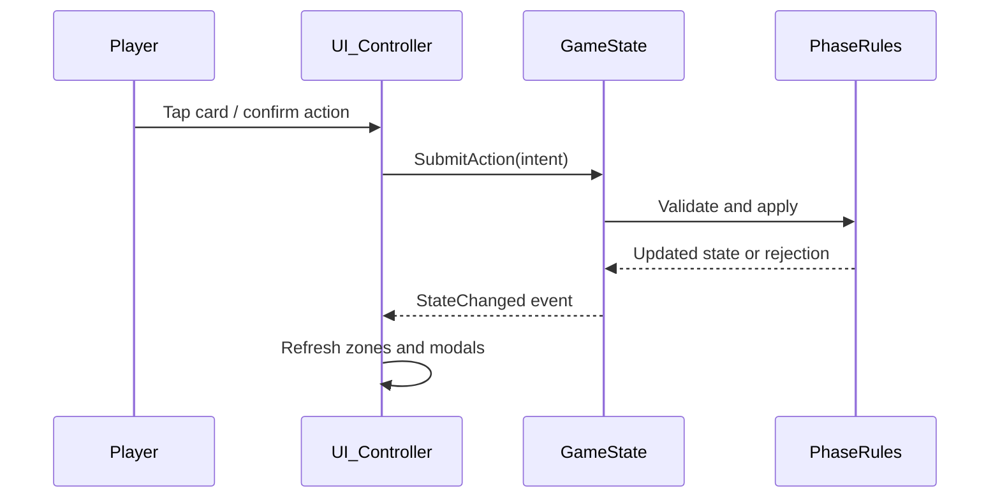

# Great Year — Architecture Reference

> **Audience:** Unity/C# developers building the Great Year mobile game. This document covers project structure and layering — not game rules. For rules see [`Rules/`](Rules/overview.md). For UI layout and mockup mapping see [`UI.md`](UI.md).

---

## Table of Contents

1. [Purpose & Scope](#1-purpose--scope)
2. [Repository Layout](#2-repository-layout)
3. [Layering](#3-layering)
4. [Mobile Defaults](#4-mobile-defaults)
5. [Data Sources](#5-data-sources)
6. [UI Framework](#6-ui-framework)

---

## 1. Purpose & Scope

**Great Year** is a greenfield Unity mobile implementation of *Kismeta: Alchemists of the Great Year*. Game rules, card data, and reference tables live in this `Docs/` folder and serve as the authoritative design reference during implementation.

Visual layout and screen flows are defined by the mockups in [`_images/mockups/`](_images/mockups/README.md). The UI uses **Unity uGUI** (Canvas, RectTransform, Image, Button, TextMeshPro) — not UI Toolkit.

This project does **not** import code from any prior bootstrap prototype. Rules logic and presentation are implemented fresh in Great Year, guided by the docs and mockups.

---

## 2. Repository Layout

Target structure under `Assets/` as the game is built out:

```
Assets/
├── Scenes/
│   ├── MainMenu.unity          Title, new game, settings
│   └── GameTable.unity         Primary play scene (table + modal overlays)
├── Prefabs/
│   └── UI/
│       ├── CardView.prefab     Single card display (face-up / face-down states)
│       ├── ZonePanel.prefab    Spread, Hand, Arcanum, deck zones
│       ├── ModalShell.prefab   Reusable overlay frame (title, body, actions)
│       ├── BoardView.prefab    Great Year wheel (see board art reference)
│       └── PhaseBanner.prefab  Season / step indicator
├── Scripts/
│   ├── Game/                   Rules, state machine, player actions
│   │   ├── State/              GameState, PlayerState, board state
│   │   ├── Phases/             Spring / Summer / Autumn / Winter logic
│   │   └── Actions/            Validated player intents (craft, duel, harvest, …)
│   └── UI/                     uGUI controllers only — no rules in UI scripts
│       ├── Table/              Persistent table layout (zones, board)
│       ├── Modals/             Phase-specific overlay controllers
│       └── Flow/               Screen flow, modal stack, input routing
├── Art/
│   └── UI/                     Sprites sliced from mockups and board art
└── Data/                       Card definitions, correspondence, cosmic ages
    └── (JSON or ScriptableObjects — TBD during implementation)
```

Only authored folders are listed. `Library/`, `Temp/`, and `Logs/` are Unity-generated and excluded from source control.

---

## 3. Layering

Keep game logic and UI presentation separate:

| Layer | Responsibility | Must not |
|-------|----------------|----------|
| **Game** | Rules, validation, state transitions, win/loss | Reference Canvas, RectTransform, or uGUI types |
| **UI** | Display state, capture touch input, drive modals | Encode rule logic (costs, legality, phase gates) |
| **Data** | Static card/codex/correspondence definitions | Hold runtime mutable state |

**Data flow (recommended):**



UI scripts subscribe to state-change events (or poll a read-only view snapshot after each action). They never mutate game state directly except by calling a single game-layer API (e.g. `SubmitAction`).

---

## 4. Mobile Defaults

Project settings in [`ProjectSettings/ProjectSettings.asset`](../ProjectSettings/ProjectSettings.asset) already target handheld:

| Setting | Current value | Notes |
|---------|---------------|-------|
| Default orientation | Auto Rotation | All orientations enabled — lock to portrait or landscape in UI doc when decided |
| Target device | Handheld | |
| Android min SDK | 25 | |
| iOS target | 15.0 | |
| Render outside safe area | Enabled (Android) | uGUI layouts should respect safe area insets for notches |

**Input:** [`Assets/InputSystem_Actions.inputactions`](../Assets/InputSystem_Actions.inputactions) includes a **UI** action map (Navigate, Submit, Cancel, Point, Click). Wire touch via the Input System or standard `GraphicRaycaster` + `EventSystem` for uGUI.

**Safe area:** Add a root `SafeAreaFitter` (or equivalent) on the main Canvas so table and modals inset correctly on notched devices.

---

## 5. Data Sources

Implement game data by referencing these docs — do not duplicate card text in code comments long-term; load from structured data files.

| Need | Doc |
|------|-----|
| Card names, effects, suits | [`Cards/`](Cards/README.md) |
| Phase steps and timing | [`Rules/phases/`](Rules/round-overview.md) |
| Cosmic age effects | [`Reference/cosmic-ages.md`](Reference/cosmic-ages.md) |
| Element ↔ suit ↔ reagent | [`Reference/correspondence.md`](Reference/correspondence.md) |
| Spread / Hand / Arcanum rules | [`Reference/card-zones.md`](Reference/card-zones.md) |
| Terms and definitions | [`Glossary.md`](Glossary.md) |

Canonical editable sources for rules and cards: [`_source/Kismeta_GameGuide.md`](_source/Kismeta_GameGuide.md) and [`_source/Kismeta_CardReference.md`](_source/Kismeta_CardReference.md). See [MAINTENANCE.md](MAINTENANCE.md) for the sync workflow.

---

## 6. UI Framework

**Use uGUI only.** Package: `com.unity.ugui` (see [`Packages/manifest.json`](../Packages/manifest.json)).

Do **not** add UI Toolkit (`com.unity.ui`), UXML, or USS for this project.

Screen layout, zone names, modal flows, Canvas conventions, and the full mockup catalog are documented in [`UI.md`](UI.md).

Board art reference (not a screen mockup): [`_images/board/Kismeta_gameBoard_final.png`](_images/board/Kismeta_gameBoard_final.png).
