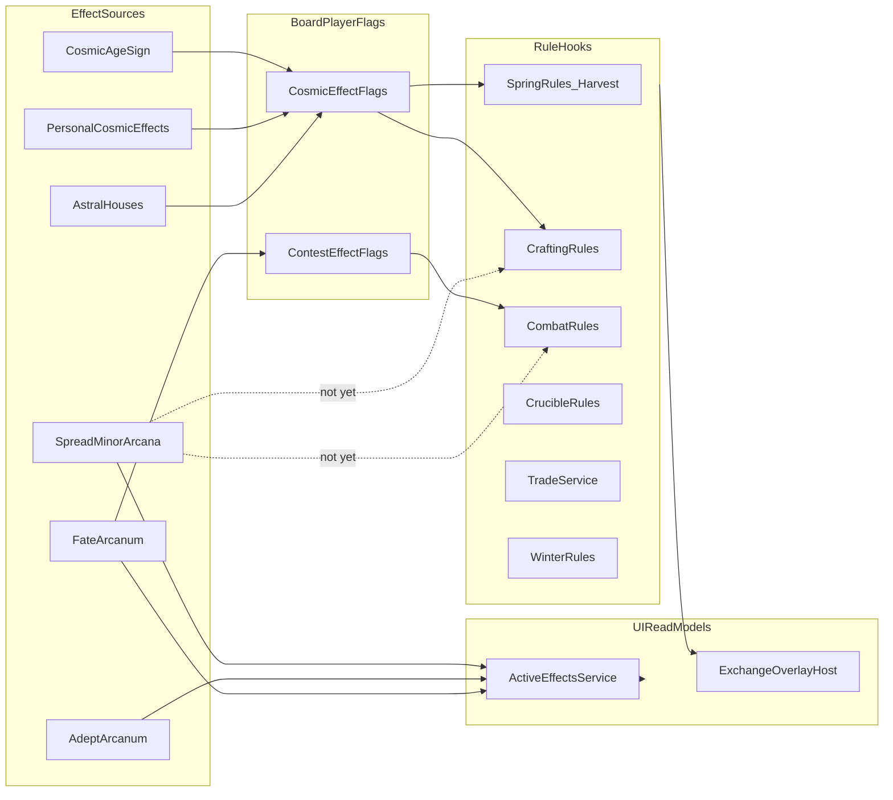

# Effect Implementation Tracker

**Last updated:** 2026-07-10 (Phase 1 combat modifiers)

Single source of truth for **which card/cosmic modifiers are enforced in gameplay** vs **display-only / not started**. Grouped by effect family (not by individual card file). Update status when wiring a new effect slice.

## Design sources

| Document | Path |
|----------|------|
| Card Reference (design) | [`Docs/_source/Kismeta_CardReference.md`](../_source/Kismeta_CardReference.md) |
| Game Guide (design) | [`Docs/_source/Kismeta_GameGuide.md`](../_source/Kismeta_GameGuide.md) |
| Player card index | [`Docs/Cards/README.md`](../Cards/README.md) |

## Maintenance rules

1. Change a row's **Status** when rule services begin mutating game state or gating actions for that modifier.
2. Name the concrete **Rule hook** file/symbol for every **Enforced** or **Pipeline** row.
3. Set **Tests** to `Yes` only when EditMode tests assert the behavior (not just UI copy).
4. Add a **Notes** entry when status is **Blocked** — cite the specific design conflict.
5. Check off phase subtasks as slices land; open GitHub issues for new slices as needed.

---

## Status legend

| Status | Meaning |
|--------|---------|
| **Enforced** | Rule service mutates game state / gates actions |
| **Pipeline** | Commands + async UI exist; core mechanic works end-to-end |
| **Partial** | Some aspects enforced; others UI-only or missing |
| **UIOnly** | Listed in Active Effects / Codex copy only |
| **NotStarted** | No rule hook |
| **Blocked** | Awaiting explicit design decision (cite conflict) |

**Tests column:** `Yes` / `Partial` / `No` — points to EditMode test files when applicable.

---

## Architecture overview

How modifiers flow through the codebase today:

### Key code anchors

| Area | File / symbol |
|------|---------------|
| Board flags | [`BoardState.cs`](../../Assets/_Project/Scripts/Core/Entities/BoardState.cs) — `CosmicEffectFlags`, `ContestEffectFlags` |
| Cosmic age → flags | [`CosmicEffectService.cs`](../../Assets/_Project/Scripts/Core/Rules/CosmicEffectService.cs) |
| Contest dice series | [`ContestDiceSeriesResolver.cs`](../../Assets/_Project/Scripts/Core/Rules/ContestDiceSeriesResolver.cs), [`CombatRules.cs`](../../Assets/_Project/Scripts/Core/Rules/CombatRules.cs) |
| Contest modifiers | [`ContestModifierService.cs`](../../Assets/_Project/Scripts/Core/Rules/ContestModifierService.cs), [`ContestCardEffectCatalog.cs`](../../Assets/_Project/Scripts/Core/Rules/ContestCardEffectCatalog.cs) |
| Adept attunement (Phase 1 combat) | [`AdeptAttunement.cs`](../../Assets/_Project/Scripts/Core/Rules/AdeptAttunement.cs) |
| Fate resolution | [`FateCardResolver.cs`](../../Assets/_Project/Scripts/Core/Rules/FateCardResolver.cs) |
| Spread display | [`SpreadCardEffectEvaluator.cs`](../../Assets/_Project/Scripts/Core/Rules/SpreadCardEffectEvaluator.cs) |
| Active Effects UI | [`ActiveEffectsService.cs`](../../Assets/_Project/Scripts/Core/Rules/ActiveEffectsService.cs) |
| Adept badges | [`AdeptEffectCatalog.cs`](../../Assets/_Project/Scripts/Core/Rules/AdeptEffectCatalog.cs) |
| Personal cosmic merge | [`AstralHouseService.cs`](../../Assets/_Project/Scripts/Core/Rules/AstralHouseService.cs) → `CosmicEffectService.ComputePersonalEffects` |

---

## Section A — Cosmic & sign modifiers

Twelve zodiac signs map to four effect categories. Board-wide age effect plus per-player personal copies (own sign + Astral Houses, no double-apply when sign matches Cosmic Age).

| Sub-group | Signs | Status | Rule hook(s) | UI | Tests | Notes |
|-----------|-------|--------|--------------|-----|-------|-------|
| +1 base Harvest | Aries, Libra | **Enforced** | `CosmicEffectService` → `SpringRules.CalculateHarvestCount` (`CosmicEffect.HarvestBaseBonus`, `PersonalCosmicEffects.HarvestBaseBonus`) | Active Effects cosmic section | Partial | `RuleServices_Tests.Harvest_Count_Bonus_For_Matching_Sign` |
| Wild court suit | Taurus (Pentacles), Leo (Wands), Scorpio (Cups), Aquarius (Swords) | **Enforced** | `CosmicEffectService` → `CraftingRules` wild court check | Active Effects | No | |
| Cheap Salt 2-for-3 | Cancer, Capricorn | **Enforced** | `CraftModifierService` → `CraftingRules` (`SaltCostsTwo`) | Active Effects | Yes | `CraftModifierService_Tests`, `RuleServices_Tests.TemperanceBase_SaltTwoAnyCards` |
| Cheap elemental 2-for-3 | Gemini (Swords/Quicksilver), Virgo (Pentacles/Vitriol), Sagittarius (Wands/Sulphur), Pisces (Cups/Aqua Regia) | **Enforced** | `CraftModifierService` + lit cauldron gate (`CheapCraftSuit` / `CheapCraftReagent`) | Active Effects | Yes | `RuleServices_Tests.Rank8_ReducesElementalCost` |
| Personal sign copy (no double-apply) | Any player sign ≠ Cosmic Age | **Enforced** | `CosmicEffectService.ComputePersonalEffects` via `AstralHouseService` | Active Effects personal section | No | |
| Astral House permanent cosmic copy | Built house signs | **Enforced** | `AstralHouseService` merges house signs into `PersonalCosmicEffects` | Active Effects | No | |
| Ace V2 passive +2 harvest when cosmic element matches | All suits, rank Ace variant 2 | **Enforced** | `HarvestModifierService` → `SpringRules.CalculateHarvestCount` | Active Effects spread + harvest breakdown | Yes | `RuleServices_Tests.AceV2_WaterCosmic_AddsTwoHarvest` |
| Spread element match +1 per aligned spread card | All spread cards | **Enforced** | `SpringRules.CalculateHarvestCount` (suit element vs cosmic element) | Harvest breakdown UI | Partial | |

**Transit reset:** `CosmicEffectService.Reset` + `WinterRules.Transit` clear `CosmicEffectFlags` and `ContestEffectFlags` each round.

---

## Section B — Contest round modifiers

| Modifier | Source | Status | Rule hook(s) | UI | Tests | Notes |
|----------|--------|--------|--------------|-----|-------|-------|
| Justice — Duel + Gambit best-of-3 | Fate ★11 | **Enforced** | `FateCardResolver.ResolveJustice` → `ContestEffectFlags`; `CombatRules` + `ContestDiceSeriesResolver` | Contest series animation; Active Effects age copy | Yes | `ContestDiceSeriesResolver_Tests`, `RuleServices_Tests` Justice block |
| 6 of Swords — Duels you start are best-of-3 | Minor spread (`minor.swords.six.1`) | **Enforced** | `ContestModifierService` + `ContestCardEffectCatalog`; scoped at resolve (not board flag) | `ActiveEffectsService.BuildDuelRelevant` | Yes | `RuleServices_Tests.SixOfSwords_AttackerOnlyBestOfThree` |
| Cups 5 — opponent reroll vs you in Duels | Minor spread curse | **Enforced** | `ContestCardEffectCatalog` → `ContestDiceSeriesResolver` keep-higher reroll | Contest response subtitle | Yes | `RuleServices_Tests.FiveOfCups_Defender_GrantsAttackerReroll` |
| Chariot resonant — reroll in any Duel | Adept ★7 resonant | **Enforced** | `AdeptAttunement` + `ContestModifierService` | Contest response subtitle | Yes | `ContestModifierService_Tests.ChariotResonant_RerollOnlyWhenAttuned` |
| Knight V1 ±1 duel dice (all suits) | Minor spread | **Enforced** | `ContestCardEffectCatalog` → `CombatRules` | Active Effects + contest preview | Yes | `ContestModifierService_Tests`, `RuleServices_Tests.Duel_KnightOfSwords_FlipsTieToAttackerWin` |
| Princess V1 ±1 gambit dice (all suits) | Minor spread | **Enforced** | `ContestCardEffectCatalog` → `CombatRules` | `BuildGambitRelevant` | Yes | `ContestModifierService_Tests.PrincessOfCups_GrantsDefenderGambitBonus` |
| Wands 5/6 reversed duel dice | Minor spread curses | **Enforced** | `ContestCardEffectCatalog` (interim: always active) | Active Effects | Partial | Negation deferred to Phase 5 |

---

## Section C — Fate cards (10)

| Card | Arcana | Status | Rule hook(s) | UI | Tests | Notes |
|------|--------|--------|--------------|-----|-------|-------|
| Tower | 16 | **Pipeline** | `FateCardResolver.ResolveTower` (arrest all Adepts) | Exchange overlay | Partial | Arrest state in `ActiveEffectsService` |
| Death | 13 | **Pipeline** | `FateCardResolver.ResolveDeath` | Exchange overlay | No | |
| Sun | 19 | **Pipeline** | `FateCardResolver.ResolveSun` (reveal top 3, keep 1) | Exchange overlay | No | |
| Judgement | 20 | **Pipeline** | `FateCardResolver.ResolveJudgement` (draw from lit cauldrons) | Exchange overlay | No | |
| Wheel of Fortune | 10 | **Pipeline** | `FateCardResolver.ResolveWheelOfFortune` | Exchange overlay | No | |
| Hanged Man | 12 | **Pipeline** | `FateCardResolver.ResolveHangedMan` (pass hands left) | Exchange overlay | No | Pass direction: see Section G |
| Justice | 11 | **Enforced** | `FateCardResolver.ResolveJustice` → `ContestEffectFlags` | Contest UI + Active Effects | Yes | |
| Moon | 18 | **Pipeline** | `FateCardResolver` queues; `GameLoop` / `CardModalsController` | Modal keep-2 UI | No | Returns `false` from `Resolve` |
| Fool | 0 | **Pipeline** | `FateCardResolver` queues; opponent gift UI | Modal UI | No | |
| Lovers | 6 | **Pipeline** | `FateCardResolver` queues; choice UI | Modal UI | No | |

**Adept purchase flow (all Adepts):** buy / decline / swap / arrest / refresh — **Pipeline** via `SpringRules` + `GameSession`; powers themselves mostly **UIOnly** (Section D).

---

## Section D — Adept effects (12 × Base + Resonant)

`effectTextResonant` is loaded into [`CardDefinition.EffectTextResonant`](../../Assets/_Project/Scripts/Core/Entities/CardDefinition.cs) for **UI copy**; enforcement uses [`AdeptResonantCatalog`](../../Assets/_Project/Scripts/Core/Rules/AdeptResonantCatalog.cs) + [`AdeptAttunement`](../../Assets/_Project/Scripts/Core/Rules/AdeptAttunement.cs) (sign matches zodiac or built house).

| Adept | ★ | Base status | Resonant status | Rule hook(s) | UI | Tests | Notes |
|-------|---|-------------|-----------------|--------------|-----|-------|-------|
| Hermit | 9 | **Partial** | **Enforced** | `SpringRules.ArcanaLimitFor` → limit 3; resonant double element tier in `AlignmentService` | Active Effects attuned line | Yes | `RuleServices_Tests.HermitResonant_*` |
| Magician | 1 | **Enforced** | **Deferred** | `AdeptRules.TryMagicianSwap` | Active Effects + GameDebugUI | Yes | Resonant reversed nullification → **Phase 5** |
| High Priestess | 2 | **Enforced** | **Enforced** | `SpringRules.ExecuteHarvest` + `CompletePriestessHarvestCommand`; resonant hand limit 7 via `PlayerLimitService` | Active Effects hand limit line | Yes | `RuleServices_Tests.PriestessResonant_*` |
| Empress | 3 | **Enforced** | **Enforced** | `CraftingRules.TryMarkEmpressReagent` + `CraftModifierService` 2-for-1; resonant 2 marks via `AdeptAttunement` | Active Effects marked types | Yes | `RuleServices_Tests.EmpressResonant_*` |
| Emperor | 4 | **Enforced** | **Enforced** | `AdeptRules.TryProtectSpreadCards` (hand+spread when attuned) + `CombatRules` / `AdeptRules.TryDevilSteal` | Active Effects protected ids | Yes | `RuleServices_Tests.EmperorResonant_*` |
| Hierophant | 5 | **Enforced** | **Enforced** | `AdeptRules.TryShiftZodiac` / `TryShiftOppositionZodiac` ±2 when attuned | Active Effects shift state | Yes | `RuleServices_Tests.HierophantResonant_*` |
| Devil | 15 | **Enforced** | **Enforced** | `AdeptRules.TryDevilSteal` + `DevilBanishAdeptCommand` when attuned | GameDebugUI | Yes | `RuleServices_Tests.DevilResonant_*` |
| Chariot | 7 | **Enforced** | **Enforced** | `CombatRules` no-ante initiation; resonant reroll via `ContestModifierService` + `AdeptAttunement` | Active Effects + GameDebugUI | Yes | `ContestModifierService_Tests.ChariotResonant_*` |
| Strength | 8 | **Enforced** | **Enforced** | `ContestModifierService` base +1 duel attack; resonant +2 duel/gambit via `AdeptAttunement` | Active Effects attuned line | Yes | `ContestModifierService_Tests.StrengthResonant_*` |
| Temperance | 14 | **Enforced** | **Enforced** | `CraftModifierService` salt at 2 any; resonant wild via `MarkTemperanceWildReagentCommand` | Active Effects wild mark | Yes | `RuleServices_Tests.TemperanceResonant_*` |
| Star | 17 | **Enforced** | **Enforced** | `AdeptEffectService.TryApplyStarPostLossDraw` + `StarNullifyCommand` / `RefreshStarNullifyCommand` + `CardEffectSuppressionService` | Active Effects suppression | Yes | `RuleServices_Tests.StarResonant_*` |
| World | 21 | **Enforced** | **Deferred** | `CrucibleRules.TryTemper` ward retention | Active Effects | Yes | Resonant crucible wildcard → **Phase 6** |

| System | Status | Rule hook(s) | UI | Tests | Notes |
|--------|--------|--------------|-----|-------|-------|
| Adept buy / decline / swap / arrest / refresh | **Pipeline** | `SpringRules`, `GameSession`, `AdeptRules` | Summer roster, inspect UI, GameDebugUI | Partial | `MarkAdeptUsed` wired for once-per-age adepts |

---

## Section E — Minor Arcana by EffectType

One row per **effect family** (not per card). Card data uses `effectType` from [`cards.json`](../../Assets/_Project/Scripts/Data/Generated/cards.json). V2 Queen/King limit/protection effects are stored as `Passive` in data.

| EffectType | Cards (ranks × suits) | Status | Target hook | UI | Tests | Notes |
|------------|----------------------|--------|-------------|-----|-------|-------|
| Entry Fee | Ace V1 (all suits) | **NotStarted** | `AstralHouseService` / ace discard build | Action badge | No | |
| Harvest | 2 V1 | **Enforced** | `HarvestModifierService.HouseDoublingBonus` → `SpringRules` | Spread passive badge + breakdown | Yes | `RuleServices_Tests.Rank2_WaterHouse_DoublesHouseBonus` |
| Build | 3 V1 | **Enforced** | `CraftModifierService` Build-salt path → `CraftingRules` | Action badge | Yes | `RuleServices_Tests.BuildV1_SaltWithTwoSuitCards` |
| Reversed | 4–6 V1 (curses) | **Partial** | Wands/Cups/Swords duel dice via `ContestCardEffectCatalog`; negation **Blocked** | Debuff badge | Partial | Phase 5 for full negation; interim always-active |
| Forge | 7 V1, Queen V1 | **NotStarted** | `CrucibleRules.TryFire` | Forge badge | No | |
| Craft | 8 V1, King V1 | **Enforced** | `CraftModifierService` rank-8 discount; `CraftingRules.TryKingDiscardCraft` | Action badge + craft cost preview | Yes | `RuleServices_Tests.Rank8_*`, `KingOfCups_*` |
| Social | 9 V1 | **NotStarted** | Post-contest draw triggers | Spread passive badge | No | |
| Opposition | 10 V1 | **NotStarted** | `AlignmentService` wild suit | Spread passive badge | No | |
| Gambit | Princess V1 | **Enforced** | `ContestCardEffectCatalog` + `CombatRules` | Combat badge | Yes | `ContestModifierService_Tests` |
| Duel | Knight V1 | **Enforced** | `ContestCardEffectCatalog` + `CombatRules` | Combat badge | Yes | `RuleServices_Tests.Duel_KnightOfSwords_FlipsTieToAttackerWin` |
| Passive | Ace V2 (+2 harvest if cosmic element); Queen V2 (+1 hand/spread limit); King V2 (suit protection) | **Partial** | Ace V2 **Enforced** via `HarvestModifierService`; Queen/King V2 still UIOnly | Buff badges | Yes (Ace V2) | Queen/King V2 → Phase 7 |
| WildcardLink | V2 ranks (all) | **NotStarted** | `CodexFormulaValidator`, `AlchemicalAlignmentValidator` | Wildcard badge | No | `wildcardArcanaNumber` in card data unused in validators |

---

## Section F — Non-card systemic modifiers

| System | Status | Rule hook(s) | UI | Tests | Notes |
|--------|--------|--------------|-----|-------|-------|
| Card Lock (Spring → Winter unlock) | **Enforced** | `GameSession.CardLockActive`, `SetCardLockCommand`, `GameLoop` | Phase UI | Partial | |
| Besieged Bonus | **Enforced** | `CrucibleRules.ResolveOpposition` (+1 defend, winner increments `BesiegedBonusCount`) | — | No | Cleared on Transit |
| Magnus misaligned trade 2:1 | **Enforced** | `TradeService` + `PlayerAspectAlignment.IsMagnusTradeRatioValid` | Trade UI | Yes | `RuleServices_Tests` Magnus trade block |
| Magnus contest +1 dice | **NotStarted** | Duels / Gambits / Opposition | — | No | No hook in `CombatRules` |
| Hand / Spread limits (5 / 5) | **Enforced** | `WinterRules.SpreadLimit`, `PlayerLimitService.GetHandLimit` (Priestess resonant → 7) | Winter discard + Commune UI | Yes | Queen V2 +1 → Phase 7 |
| Crucible lifecycle (activate / fire / temper / stasis) | **Pipeline** | `CrucibleRules` | Autumn forge UI | Partial | `RuleServices_Tests` crucible block; separate from card wildcards |
| Agekeeper's Boon (+2 harvest when Agekeeper sign matches cosmic) | **Enforced** | `SpringRules.CalculateHarvestCount` | Harvest breakdown | Partial | |
| Spread element alignment +1 harvest | **Enforced** | `SpringRules.CalculateHarvestCount` | Harvest breakdown | Partial | |
| Adept aspect alignment harvest bonus | **Enforced** | `SpringRules.CalculateHarvestCount` | Harvest breakdown | No | Arrested adepts excluded from scoring TBD |
| Fateful Wager | **Enforced** | `WinterRules.ResolveWagers` | Winter UI | Yes | `RuleServices_Tests` wager block |

---

## Section G — Known doc conflicts

Defer resolution until the slice that needs them:

| Conflict | Sources | Impact | Tracker action |
|----------|---------|--------|----------------|
| Reversed curse negation procedure undefined | Card Reference alignment vs curse text | Ranks 4–6 V1 cannot be **Enforced** | **Blocked** — Phase 5 |
| Hand limit 5 vs 7 (Priestess resonant) | Game Guide vs Adept resonant text | `PlayerLimitService` dynamic hand limit | **Resolved** — Phase 4 |
| Arcanum limit 2 vs Hermit 3 vs doc "Hierophant" typo | Card Reference overview table | Hermit 3 enforced; doc says Hierophant | Document only; code uses Hermit ★9 |
| Justice scope | Card Reference vs implementation | Duel + Gambit only (not Opposition) | **Resolved** in code |
| Hanged Man pass direction | Game Guide wording | `ResolveHangedMan` passes to higher player id (wrap) | Confirm vs "left" convention |
| Coal / cauldron choice vs codex table | Game Guide vs Crucible reference | Crafting UI | Defer to craft slice |
| Knight attack/defend suit mapping | Card Reference vs `cards.json` | Cups/Pentacles vs Swords/Wands inverted | **Resolved** — implement from `cards.json` |
| Resonant vs Attuned terminology | Card Reference / UI copy | `AdeptAttunement.IsAttuned` alias + attuned badge | **Resolved** — Phase 4 |
| `effectTextResonant` not in enforcement | Data loader vs rules | UI copy via `CardDefinition`; rules use catalog | **Resolved** — Phase 4 |

---

## Recommended implementation order

Phases are ordered by dependency. Check subtasks as slices ship.

### Phase 0 — Foundation ✅ (complete)

Contest effect flags, dice series resolver, Justice vertical slice.

- [x] `ContestEffectFlags` on `BoardState`
- [x] `ContestDiceSeriesResolver` (ties favor defender; best-of-3 stops at 2 round wins)
- [x] `FateCardResolver.ResolveJustice` sets Duel + Gambit flags
- [x] `CombatRules` series integration; stake applied once from final winner
- [x] Transit reset via `WinterRules` + `CosmicEffectService.Reset`
- [x] Contest UI series animation + Active Effects copy
- [x] EditMode tests: `ContestDiceSeriesResolver_Tests`, Justice block in `RuleServices_Tests`

### Phase 1 — Combat dice & series scope ✅ (complete)

Extend `ContestEffectFlags` + `CombatRules` queries. Depends on Phase 0.

- [x] Knight V1 ±1 duel dice (all suits)
- [x] Princess V1 ±1 gambit dice (all suits)
- [x] Strength base +1 / resonant +2 duel & gambit dice
- [x] Chariot resonant duel reroll
- [x] Wands 5/6 reversed combat dice (interim always-active)
- [x] 6 of Swords scoped best-of-3 (initiator-only, separate from Justice board flag)
- [x] Cups 5 opponent reroll vs you in duels
- [x] Contest effect preview in duel/gambit UI (`BuildGambitRelevant`, `ContestResponseController`)
- [x] Tests: `ContestModifierService_Tests`, `ContestDiceSeriesResolver_Tests`, `RuleServices_Tests` Phase 1 block

### Phase 2 — Craft & harvest modifiers

- [x] Ace V2 passive +2 harvest when cosmic element matches (`SpringRules` + `HarvestModifierService`)
- [x] Minor rank 2 Harvest V1 (Astral House element doubling)
- [x] Minor rank 3 Build V1 (suit-specific salt craft)
- [x] Minor rank 8 Craft V1 + King V1 discard craft
- [x] Empress base/resonant 2-for-1 overlap with cosmic cheap craft
- [x] Temperance base/resonant salt wild overlap
- [x] Tests: `HarvestModifierService_Tests`, `CraftModifierService_Tests`, `RuleServices_Tests` Phase 2 block

### Phase 3 — Adept Base passives

Follow `FateCardResolver` switch / service pattern per adept.

- [x] Magician — ignore Card Lock; hand/spread swap
- [x] Emperor — protect 2 spread cards in duels/gambits
- [x] Chariot — initiate duels without ante
- [x] Star — draw 2 after contest loss
- [x] Strength — +1 duel dice (done in Phase 1; base only when attacking)
- [x] Hierophant — zodiac shift ±1 for harvest/opposition
- [x] Devil — sacrifice to steal spread card
- [x] Priestess — deck harvest + return 2 (base only)
- [x] World — ward reagents persist after transmutation
- [x] Wire `MarkAdeptUsed` from rule paths for once-per-age adepts
- [x] Tests: `AdeptEffectService_Tests`, `RuleServices_Tests` Phase 3 block

### Phase 4 — Adept Resonant layer ✅ (complete)

Deferred per scope: Magician ★1 resonant → Phase 5; World ★21 resonant → Phase 6.

- [x] Load `effectTextResonant` into `CardDefinition` (UI); `AdeptResonantCatalog` for enforcement
- [x] Attuned predicate (`AdeptAttunement` + tests)
- [x] Priestess resonant hand limit 7 (`PlayerLimitService`)
- [x] Emperor resonant broad protection (hand+spread, duel+gambit+devil)
- [x] Hierophant resonant ±2 shift
- [x] Hermit resonant double elemental alignment
- [x] Devil resonant banish adept
- [x] Star resonant nullify + `CardEffectSuppressionService` + Salt refresh
- [x] Consolidate Strength/Chariot/Empress/Temperance resonant (tracker + tests)
- [x] Active Effects attuned badges + GameDebugUI resonant hooks
- [ ] Magician resonant reversed nullification — **deferred Phase 5**
- [ ] World resonant crucible wildcard — **deferred Phase 6**

### Phase 5 — Reversed curse system

**Blocked** — needs negation rule design decision.

- [ ] Define alignment-negates-curse procedure
- [ ] Enforce in spread validation / combat / craft layers
- [ ] Update `SpreadCardEffectEvaluator` inactive state when negated

### Phase 6 — Wildcard substitution

- [ ] `WildcardArcanaNumber` in `CodexFormulaValidator`
- [ ] Wildcard in `AlchemicalAlignmentValidator` / fire validators
- [ ] World resonant crucible wildcard + salt refresh

### Phase 7 — Limits & protection

- [ ] Queen V2 hand/spread +1 at round end (`WinterRules` dynamic limits)
- [ ] King V2 suit protection in `CombatRules.ValidateDuelCards`
- [ ] Cups 4 and related protection cards
- [ ] Emperor protection overlap
- [ ] Winter discard UI respects dynamic limits

### Phase 8 — Social & forge triggers

- [ ] Rank 9 Social — draw on contest win
- [ ] Rank 7 / Queen V1 Forge — reagent on fire
- [ ] Entry Fee ace V1 — astral house build discount

### Phase 9 — UI polish per slice

- [ ] Exchange modals for remaining fate edge cases
- [ ] Contest effect previews (both players)
- [ ] AI awareness of active combat/craft modifiers
- [ ] Magnus contest +1 dice (game mode)

---

## Spot-check log (2026-07-10)

Verified against live code:

| Row | Expected | Verified |
|-----|----------|----------|
| Justice | `ContestEffectFlags` + series resolver | ✅ `FateCardResolver.ResolveJustice`, `CombatRules` lines 133/252 |
| Cosmic +1 harvest | `HarvestBaseBonus` in harvest count | ✅ `CosmicEffectService` + `SpringRules.CalculateHarvestCount` |
| Fate Tower | Arrest adepts on draw | ✅ `FateCardResolver.ResolveTower` |
| Knight V1 duel | UIOnly | ✅ `SpreadCardEffectEvaluator` only; no `CombatRules` dice hook |
| Magnus trade 2:1 | Reject 1:1 misaligned | ✅ `TradeService` + `RuleServices_Tests` |
