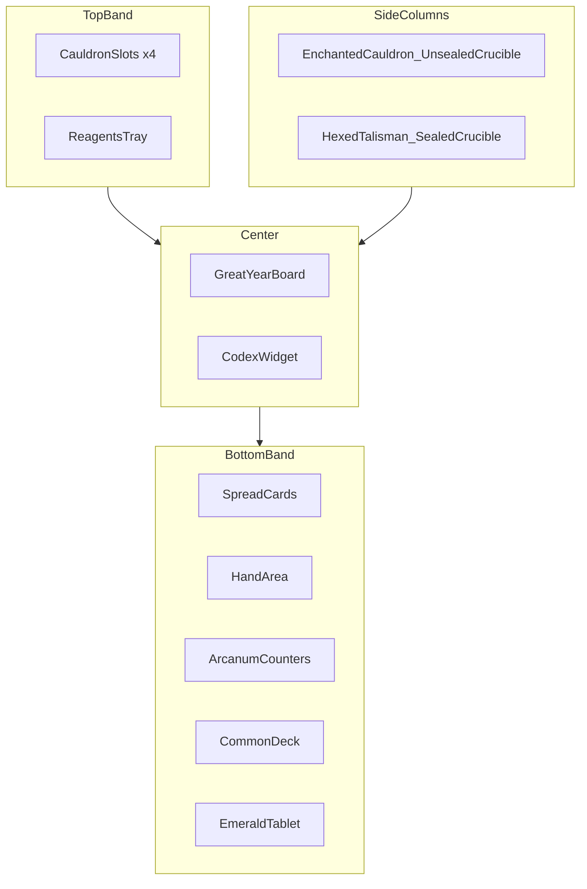

# Great Year — UI Specification (uGUI)

> **Audience:** Developers implementing the mobile UI. Game rules live in [`Rules/`](Rules/overview.md). Project structure in [`ARCHITECTURE.md`](ARCHITECTURE.md). Mockup files indexed in [`_images/mockups/README.md`](_images/mockups/README.md).

**Framework:** Unity **uGUI** only (`Canvas`, `RectTransform`, `Image`, `Button`, TextMeshPro). Do not use UI Toolkit (UXML/USS).

---

## Table of Contents

1. [Design principles](#1-design-principles)
2. [uGUI conventions](#2-ugui-conventions)
3. [Main table layout](#3-main-table-layout)
4. [Screen catalog](#4-screen-catalog)
5. [Prefab checklist](#5-prefab-checklist)

---

## 1. Design principles

- **Table-first:** The game table (`GameTable` scene) stays visible during play. Phase actions use modal overlays on top — not separate scenes — unless noted (main menu, win screen).
- **Mockup-driven:** Layout, spacing, and flow match [`_images/mockups/`](_images/mockups/README.md). When mockups and rules docs disagree, treat the mockup as the UX target and rules as behavior authority.
- **Touch-first:** Large tap targets for cards and zone buttons. Avoid hover-only affordances.
- **Read-only opponent info:** Follow [`Reference/card-zones.md`](Reference/card-zones.md) — opponent Hands are hidden; Spreads and public board state are visible.

---

## 2. uGUI conventions

### Canvas setup

| Setting | Recommendation |
|---------|----------------|
| Render mode | Screen Space — Overlay (or Camera if post-processing needed) |
| Canvas Scaler | Scale With Screen Size |
| Reference resolution | **1080 × 1920** portrait (adjust if mockups target landscape) |
| Match | 0.5 (balance width/height) |

Use **nested canvases** to limit rebuild cost:

- **TableCanvas** — static zones, board, reagents (low churn)
- **ModalCanvas** — overlays, dice rolls, action sheets (high churn)
- **HUDCanvas** — phase banner, toasts, turn indicator

Each canvas with dynamic content gets its own `GraphicRaycaster`. One shared `EventSystem` per scene.

### Safe area

Apply safe-area padding on the root panel under each canvas so content clears notches and home indicators. Test on Android (render outside safe area enabled) and iOS.

### Input

- Primary: touch via `GraphicRaycaster` + `EventSystem`
- Optional: [`InputSystem_Actions.inputactions`](../Assets/InputSystem_Actions.inputactions) UI map for gamepad / keyboard in editor

### Modal stacking

```
Table (always rendered)
  └── PhaseBanner (season / active player)
  └── ModalShell (current action: craft, duel, roll, …)
       └── Sub-step panels (ante → target → roll → result)
```

Only one blocking modal chain at a time. Back / Cancel returns to previous sub-step or dismisses if allowed by rules.

### Card display

`CardView` prefab states:

- Face-down (deck, sealed crucible)
- Face-up (spread, hand, arcanum)
- Selected / highlighted (valid target, commune selection)
- Disabled (illegal target)

Use `HorizontalLayoutGroup` / `GridLayoutGroup` for Spread and Hand rows; `LayoutElement` for minimum card size.

---

## 3. Main table layout

Reference mockup: [`fullTable_mockup_1_START_labels.png`](_images/mockups/fullTable_mockup_1_START_labels.png)

Also see: [`table_overview.png`](_images/mockups/table_overview.png)



### Zone map

| Mockup label | Game concept | uGUI root | Rules reference |
|--------------|--------------|-----------|-----------------|
| Spread Cards | Cards committed to spread (visible) | `SpreadPanel` | [Card zones](Reference/card-zones.md) |
| Hand | Private reserve | `HandPanel` | [Card zones](Reference/card-zones.md) |
| Arcanum | Arcanum pile + count | `ArcanumPanel` | [Card zones](Reference/card-zones.md) |
| Common Deck | Draw pile | `DeckWidget` | [Components](Rules/components.md) |
| Emerald Tablet | Player tablet / alignment aid | `TabletWidget` | [Overview](Rules/overview.md) |
| Codex | Active crucible codex formula | `CodexPanel` | [Summer: Crucible](Rules/phases/summer.md) |
| Cauldrons (top row) | Lit cauldron slots | `CauldronRow` | [Correspondence](Reference/correspondence.md) |
| Reagents | Reagent token tray | `ReagentTray` | [Correspondence](Reference/correspondence.md) |
| Sealed Crucible Cards | Face-down crucible queue | `SealedCrucibleZone` | [Setup](Rules/setup.md) |
| Unsealed Crucible Card | Active crucible card | `UnsealedCrucibleZone` | [Summer](Rules/phases/summer.md) |
| Hexed Talisman | Talisman slot (hexed state) | `HexedTalismanZone` | [Summer](Rules/phases/summer.md) |
| Enchanted Cauldron w/ Cleansed Talisman | Cleansed talisman / cauldron | `CleansedTalismanZone` | [Summer](Rules/phases/summer.md) |
| Center board | Great Year wheel | `BoardView` | [Board art](_images/board/Kismeta_gameBoard_final.png), [Cosmic ages](Reference/cosmic-ages.md) |

Board art asset: [`Kismeta_gameBoard_final.png`](_images/board/Kismeta_gameBoard_final.png) — zodiac segments, transmutation path, mantle/crucible ring.

---

## 4. Screen catalog

Each row links a mockup file to its UI role and rules section. Full index: [`_images/mockups/README.md`](_images/mockups/README.md).

### Meta / navigation

| Mockup | Purpose | UI pattern | Rules |
|--------|---------|------------|-------|
| [`table_overview.png`](_images/mockups/table_overview.png) | Table layout overview | Base `GameTable` scene | [Round overview](Rules/round-overview.md) |
| [`fullTable_mockup_1_START_labels.png`](_images/mockups/fullTable_mockup_1_START_labels.png) | Labeled zone reference | Zone naming for prefabs | [Setup](Rules/setup.md) |
| [`chronicleGreatYear.png`](_images/mockups/chronicleGreatYear.png) | Round / age history | Full-screen or slide-over chronicle | [Round overview](Rules/round-overview.md) |
| [`winGame.png`](_images/mockups/winGame.png) | Victory | Full-screen overlay | [Winning](Rules/winning.md) |

### Spring — Phase 1

| Mockup | Purpose | UI pattern | Rules |
|--------|---------|------------|-------|
| [`spring_start.png`](_images/mockups/spring_start.png) | Spring phase entry | Phase banner + table | [Spring](Rules/phases/spring.md) |
| [`springPhase.png`](_images/mockups/springPhase.png) | Spring step indicator | `PhaseBanner` | [Spring](Rules/phases/spring.md) |
| [`spring_harvest.png`](_images/mockups/spring_harvest.png) | Harvest resolution | Modal: draw + bonus tally | [Spring: Harvest](Rules/phases/spring.md) |
| [`spring_rollZodiac.png`](_images/mockups/spring_rollZodiac.png) | Zodiac dice roll | Dice modal + result on board | [Spring: Zodiac roll](Rules/phases/spring.md) |
| [`spring_communeStart.png`](_images/mockups/spring_communeStart.png) | Commune entry | Modal intro | [Spring: Commune](Rules/phases/spring.md) |
| [`spring_communeArrange.png`](_images/mockups/spring_communeArrange.png) | Commune card move | Drag/tap between Hand ↔ Spread | [Spring: Commune](Rules/phases/spring.md) |
| [`spring_communeArrange1.png`](_images/mockups/spring_communeArrange1.png) | Commune (alt layout) | Same as above | [Spring: Commune](Rules/phases/spring.md) |

Cosmic age roll UI may share the dice modal pattern with zodiac roll; see Spring rules for Agekeeper steps.

### Summer — Phase 2

| Mockup | Purpose | UI pattern | Rules |
|--------|---------|------------|-------|
| [`summerPhase_main.png`](_images/mockups/summerPhase_main.png) | Summer action menu | Bottom sheet / action list | [Summer](Rules/phases/summer.md) |
| [`summerPhase_consort.png`](_images/mockups/summerPhase_consort.png) | Consort / social actions | Action sheet panel | [Summer](Rules/phases/summer.md) |
| [`summerPhase_craft.png`](_images/mockups/summerPhase_craft.png) | Crafting entry from menu | Action sheet → craft flow | [Summer: Craft](Rules/phases/summer.md) |
| [`activateCrucibleCard.png`](_images/mockups/activateCrucibleCard.png) | Activate crucible | Modal: select cards + confirm | [Summer: Crucible](Rules/phases/summer.md) |
| [`lightCauldron.png`](_images/mockups/lightCauldron.png) | Light cauldron (coal) | Modal: cauldron choice | [Summer](Rules/phases/summer.md) |
| [`craftReagent.png`](_images/mockups/craftReagent.png) | Craft reagent — select cards | Modal: pick 3 suit cards | [Summer: Craft reagent](Rules/phases/summer.md) |
| [`craftReagent_result.png`](_images/mockups/craftReagent_result.png) | Craft reagent — result | Result toast / modal | [Summer: Craft reagent](Rules/phases/summer.md) |
| [`buildAstralHouse.png`](_images/mockups/buildAstralHouse.png) | Build astral house | Modal: pay cards, place on wheel | [Summer: Astral houses](Rules/phases/summer.md) |
| [`placeWards.png`](_images/mockups/placeWards.png) | Place reagent wards | Modal: ward target selection | [Summer / Autumn wards](Rules/phases/summer.md) |
| [`seasonTransit_summer.png`](_images/mockups/seasonTransit_summer.png) | Enter Summer | Season transit overlay | [Round overview](Rules/round-overview.md) |

### Combat — Duel & Gambit

| Mockup | Purpose | UI pattern | Rules |
|--------|---------|------------|-------|
| [`duel_startAnte.png`](_images/mockups/duel_startAnte.png) | Duel — ante | Wizard step 1 | [Summer: Duel](Rules/phases/summer.md) |
| [`duel_target.png`](_images/mockups/duel_target.png) | Duel — choose target | Wizard step 2 | [Summer: Duel](Rules/phases/summer.md) |
| [`duel_roll.png`](_images/mockups/duel_roll.png) | Duel — roll | Dice modal | [Summer: Duel](Rules/phases/summer.md) |
| [`duel_result.png`](_images/mockups/duel_result.png) | Duel — outcome | Result panel | [Summer: Duel](Rules/phases/summer.md) |
| [`gambit_start.png`](_images/mockups/gambit_start.png) | Gambit — start | Wizard step 1 | [Summer: Gambit](Rules/phases/summer.md) |
| [`gambit_ante.png`](_images/mockups/gambit_ante.png) | Gambit — ante | Wizard step 2 | [Summer: Gambit](Rules/phases/summer.md) |
| [`gambit_matchWard.png`](_images/mockups/gambit_matchWard.png) | Gambit — match ward | Wizard step 3 | [Summer: Gambit](Rules/phases/summer.md) |
| [`gambit_rollDice.png`](_images/mockups/gambit_rollDice.png) | Gambit — roll | Dice modal | [Summer: Gambit](Rules/phases/summer.md) |
| [`gambit_result.png`](_images/mockups/gambit_result.png) | Gambit — outcome | Result panel | [Summer: Gambit](Rules/phases/summer.md) |

### Autumn — Phase 3

| Mockup | Purpose | UI pattern | Rules |
|--------|---------|------------|-------|
| [`autumn_start.png`](_images/mockups/autumn_start.png) | Autumn phase entry | Phase banner | [Autumn](Rules/phases/autumn.md) |
| [`opposition_start.png`](_images/mockups/opposition_start.png) | Opposition — start | Modal wizard | [Autumn: Opposition](Rules/phases/autumn.md) |
| [`opposition_tally.png`](_images/mockups/opposition_tally.png) | Opposition — tally | Tally panel | [Autumn: Opposition](Rules/phases/autumn.md) |
| [`opposition_rollDice.png`](_images/mockups/opposition_rollDice.png) | Opposition — roll | Dice modal | [Autumn: Opposition](Rules/phases/autumn.md) |
| [`opposition_result.png`](_images/mockups/opposition_result.png) | Opposition — result | Result panel | [Autumn: Opposition](Rules/phases/autumn.md) |
| [`opposition_sendToStasis.png`](_images/mockups/opposition_sendToStasis.png) | Send to stasis | Confirm + board update | [Autumn: Stasis](Rules/phases/autumn.md) |
| [`leaveStasis.png`](_images/mockups/leaveStasis.png) | Leave stasis — start | Modal | [Autumn: Stasis](Rules/phases/autumn.md) |
| [`leaveStasis_end.png`](_images/mockups/leaveStasis_end.png) | Leave stasis — resolved | Result + board | [Autumn: Stasis](Rules/phases/autumn.md) |

Stone firing and tempering flows use the same modal + board-update pattern; see Autumn rules for Forge and Temper steps.

### Winter — Phase 4 & age transit

| Mockup | Purpose | UI pattern | Rules |
|--------|---------|------------|-------|
| [`winter_cardUnlock.png`](_images/mockups/winter_cardUnlock.png) | Card unlock | Modal: Hand ↔ Spread moves | [Winter: Card unlock](Rules/phases/winter.md) |
| [`winter_cardLimits.png`](_images/mockups/winter_cardLimits.png) | Enforce card limits | Modal: choose discards | [Winter: Card limits](Rules/phases/winter.md) |
| [`winter_fatefulWager.png`](_images/mockups/winter_fatefulWager.png) | Fateful wager | Wager modal | [Winter: Fateful wager](Rules/phases/winter.md) |
| [`winter_fatefulWager_select.png`](_images/mockups/winter_fatefulWager_select.png) | Fateful wager — card pick | Selection overlay | [Winter: Fateful wager](Rules/phases/winter.md) |
| [`winter_end.png`](_images/mockups/winter_end.png) | Winter complete | Phase summary | [Winter](Rules/phases/winter.md) |
| [`newAge_start.png`](_images/mockups/newAge_start.png) | Transit age — start | Transit overlay | [Winter: Transit](Rules/phases/winter.md) |
| [`newAge_result.png`](_images/mockups/newAge_result.png) | Transit age — result | Result overlay | [Winter: Transit](Rules/phases/winter.md) |
| [`newAge_fatefulWager_result.png`](_images/mockups/newAge_fatefulWager_result.png) | Wager resolved at new age | Combined result screen | [Winter](Rules/phases/winter.md) |

---

## 5. Prefab checklist

Minimum prefabs to cover the catalog above:

| Prefab | Used by |
|--------|---------|
| `CardView` | All zones, modals, combat |
| `ModalShell` | All phase overlays |
| `DiceRollPanel` | Spring zodiac, duel, gambit, opposition |
| `PhaseBanner` | Season transitions |
| `ActionSheet` | Summer main / consort / craft menus |
| `BoardView` | Table center — zodiac, stones, houses |
| `ZonePanel` | Spread, Hand, Arcanum, decks |
| `ReagentToken` | Reagent tray, wards, crafting costs |
| `PlayerIndicator` | Active player, Agekeeper |

Implement scenes in order: **GameTable** (zones + board) → **Spring harvest/commune modals** → **Summer action sheet** → **Combat wizards** → **Autumn/Winter** → **Win / Chronicle** overlays.
