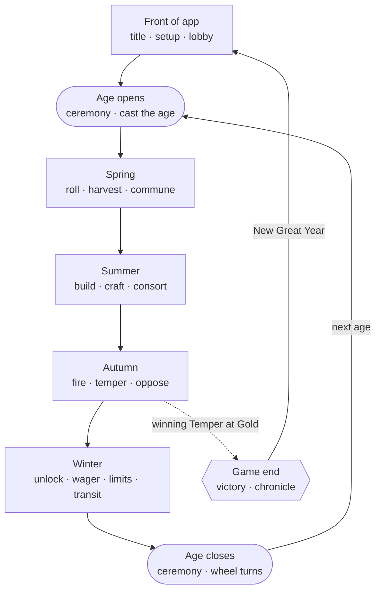
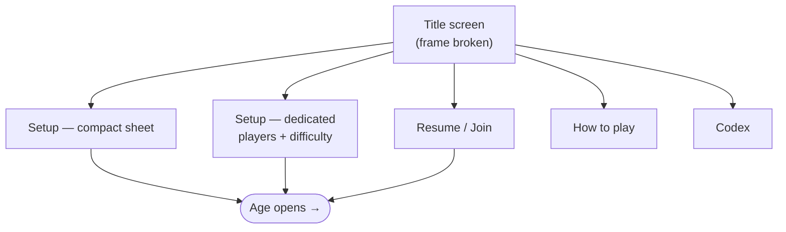
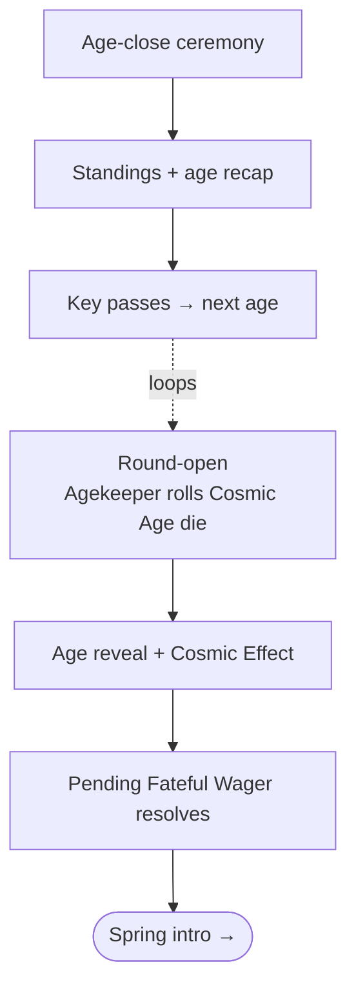
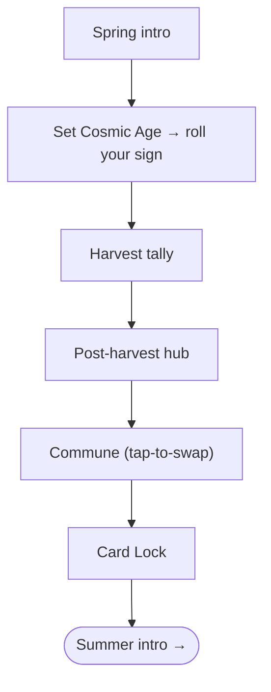
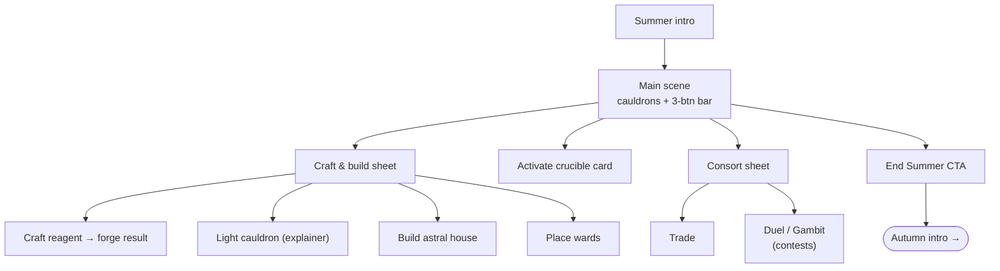
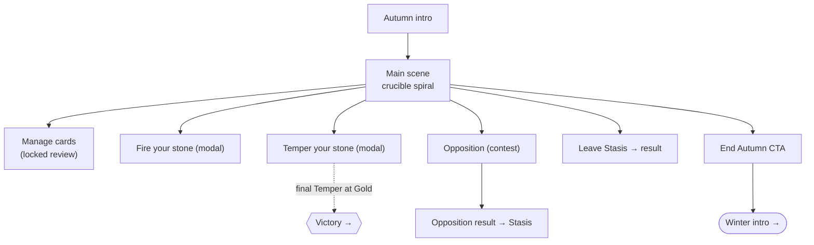
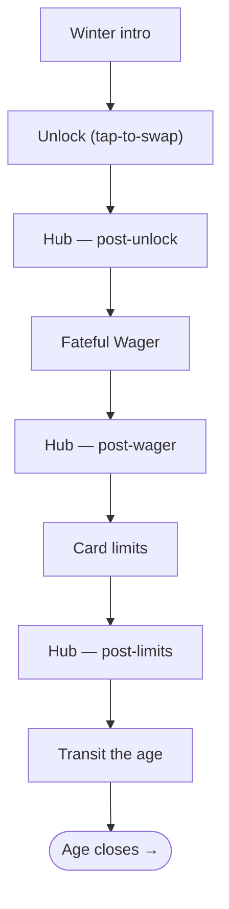
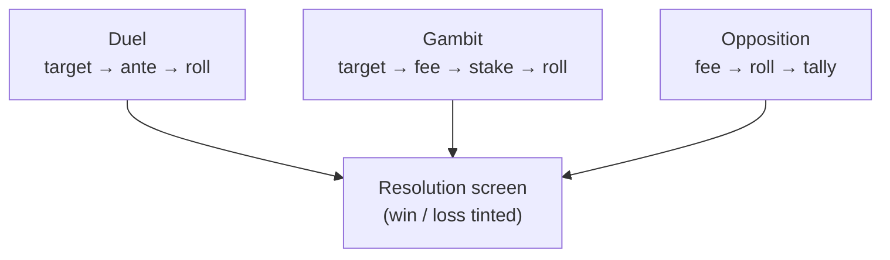
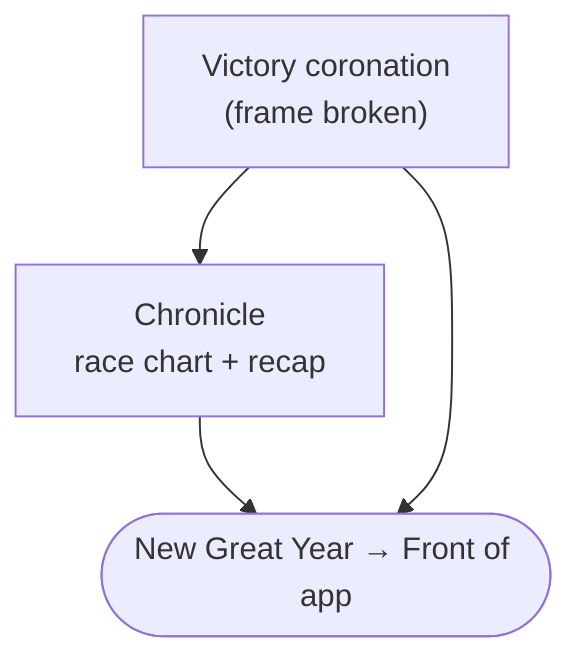
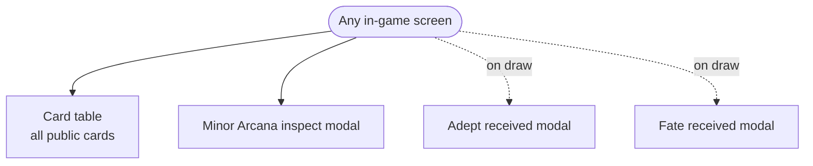

# Kismeta: Alchemists of the Great Year
## Mobile App — Flow Map

*Companion to the UI & Visual Style Guide. The style guide documents **what each
screen is**; this document maps **how they connect**. Every screen mocked up to
date is accounted for here.*

---

## 1. How the app is structured

The app is not a linear flow — it is a **cycle** with three nested tiers:

```
GAME  →  AGE (one full round)  →  SEASON (Spring/Summer/Autumn/Winter)  →  STEP / ACTION
```

- A **game** is a sequence of **ages**, looping until one player completes the Great Work.
- An **age** is one full round, bracketed by the **age-open** and **age-close** ceremonies.
- Inside each age, play moves through **four seasons** in order.
- Each season contains **steps** (sequenced seasons: Spring, Winter) or **actions**
  (free-choice seasons: Summer, Autumn).

Two groups of screens sit **outside** the linear flow:
- **Game-end** (victory, chronicle) — reached when a stone completes the Great Work.
- **Persistent overlays** (card table, card modals) — reachable from anywhere.

---

## 2. Top-level cycle



The dashed line from Autumn marks the win exit: the final Temper at Gold reaches the
Altar and ends the game. Otherwise the round loops — Age-close casts the next age and
returns to the age-open.

---

## 3. Front of app



- **Title screen** — ceremonial, gold-on-dark, the "8" altar sigil. Entry to everything.
- **Setup (compact sheet)** — quick start: players, mode, deck, Agekeeper + summary line.
- **Setup (dedicated)** — fuller: player count 2–6 with descriptors; difficulty as three
  concrete rule-sets (Quickplay / Standard / Magnus) with a live "what changes" panel.
- **Resume / Join**, **How to play**, **Codex** — secondary menu destinations.

---

## 4. Age ceremonies (frame broken)



The **age-open** (rising) and **age-close** (setting) mirror each other. The pending
wager from the previous Winter resolves at the open, against the freshly-cast age.

---

## 5. Spring (sequenced — map season)



The **hub** sits between harvest and commune — the pause before the round's biggest
card-placement decision. Commune is interactive (move Minor Arcana between Spread and Hand).

---

## 6. Summer (free-choice — state season)



Free-choice: actions taken in any order, any number of times, until **End Summer**.
"Craft & build" and "Consort" open sheets; "Activate" is atomic. Contests
(Duel/Gambit) are shared components — see §9.

---

## 7. Autumn (free-choice — map season)



The winning Temper at Gold exits to Victory. Opposition sends a rival to Stasis;
**Leave Stasis** is the defender's recovery (2 Salt or a Stasis Opposition).

---

## 8. Winter (sequenced — step-hub season)



The **hub** is the persistent home base, re-rendering at each step (post-unlock →
post-wager → post-limits). The Fateful Wager is optional; its stake resolves next
Spring at the age-open (§4).

---

## 9. Contests (shared components)

Launched from **Summer → Consort** (Duel, Gambit) and **Autumn → Oppose** (Opposition).
All share the step-wizard spine and the dual-die component.



- **Duel** — roll is the score; steal a Spread card.
- **Gambit** — ward-fee gate; roll is the score; swap or arrest.
- **Opposition** — roll sets your sign, feeds an alignment tally; higher total wins.

---

## 10. Game end (off the linear flow)



Reached only when a stone completes the Great Work (the winning Temper). Victory
celebrates; Chronicle explains. Both loop back to the front of app.

---

## 11. Persistent overlays (reachable from anywhere)

These are not in the linear flow — they open over the current screen via the header
menu or by tapping a card, then return.



- **Card table** — survey of every player's *public* cards (hidden Hands shown as counts
  only); inline Duel/Gambit/Trade launchers per rival.
- **Minor Arcana inspect** — tap any card for full aspects, alignment-this-age, effect.
- **Adept received** / **Fate received** — fire on drawing a Major Arcana (a tool you
  wield vs. an event that befalls you).

---

## 12. Full screen index

| # | Screen | Region | Tier |
|---|---|---|---|
| 1 | Title screen | Shell | ceremony |
| 2 | Setup — compact sheet | Shell | — |
| 3 | Setup — dedicated (players + difficulty) | Shell | — |
| 4 | Resume / Join | Shell | — |
| 5 | How to play | Shell | — |
| 6 | Codex | Shell | — |
| 7 | Round-open (Agekeeper rolls) | Age open | ceremony |
| 8 | Age reveal + Cosmic Effect | Age open | ceremony |
| 9 | Pending wager resolves | Age open | ceremony |
| 10 | Spring intro | Spring | season intro |
| 11 | Roll your sign | Spring | step |
| 12 | Harvest tally | Spring | step |
| 13 | Post-harvest hub | Spring | hub |
| 14 | Commune | Spring | step |
| 15 | Card Lock → Summer | Spring | transition |
| 16 | Summer intro | Summer | season intro |
| 17 | Summer main scene | Summer | main |
| 18 | Craft & build sheet | Summer | action group |
| 19 | Craft reagent | Summer | action |
| 20 | Forge result | Summer | result |
| 21 | Activate crucible card | Summer | action |
| 22 | Light cauldron (explainer) | Summer | action |
| 23 | Build astral house | Summer | action |
| 24 | Place wards | Summer | action |
| 25 | Consort sheet | Summer | action group |
| 26 | Trade | Summer | action |
| 27 | End Summer CTA | Summer | end-CTA |
| 28 | Autumn intro | Autumn | season intro |
| 29 | Autumn main scene | Autumn | main |
| 30 | Manage cards (locked review) | Autumn | overlay |
| 31 | Fire your stone (modal) | Autumn | action |
| 32 | Temper your stone (modal) | Autumn | action |
| 33 | Opposition result → Stasis | Autumn | result |
| 34 | Leave Stasis | Autumn | action |
| 35 | Leave Stasis result | Autumn | result |
| 36 | End Autumn CTA | Autumn | end-CTA |
| 37 | Winter intro | Winter | season intro |
| 38 | Hub — post-unlock | Winter | hub |
| 39 | Unlock | Winter | step |
| 40 | Fateful Wager | Winter | step |
| 41 | Hub — post-wager | Winter | hub |
| 42 | Card limits | Winter | step |
| 43 | Hub — post-limits | Winter | hub |
| 44 | Transit the age | Winter | step |
| 45 | Age-close ceremony | Age close | ceremony |
| 46 | Standings + age recap | Age close | ceremony |
| 47 | Duel | Contest (shared) | contest |
| 48 | Gambit | Contest (shared) | contest |
| 49 | Opposition | Contest (shared) | contest |
| 50 | Victory coronation | Game end | ceremony |
| 51 | Chronicle | Game end | — |
| 52 | Card table | Overlay | overlay |
| 53 | Minor Arcana inspect | Overlay | modal |
| 54 | Adept received | Overlay | modal |
| 55 | Fate received | Overlay | modal |

---

## 13. Not yet built (from the style-guide backlog)

These appear in neither the diagrams nor the index because they remain unbuilt:

- Court-card inspect variant (conditional Wild Suits)
- Set-awareness assist (Commune / Activate / inspect)
- Direct card-tap dueling from the card table
- Multiplayer turn-handoff (pass-and-play / async, hidden-hand protection)
- Tutorial / onboarding (the guided first game)
- Codex reference UI (cards, the 12 ages, states, glossary)

---

*Kismeta: Alchemists of the Great Year © 2026 Goodmagik Games. Flow map of the
mobile-port mockups produced during design workshop.*
